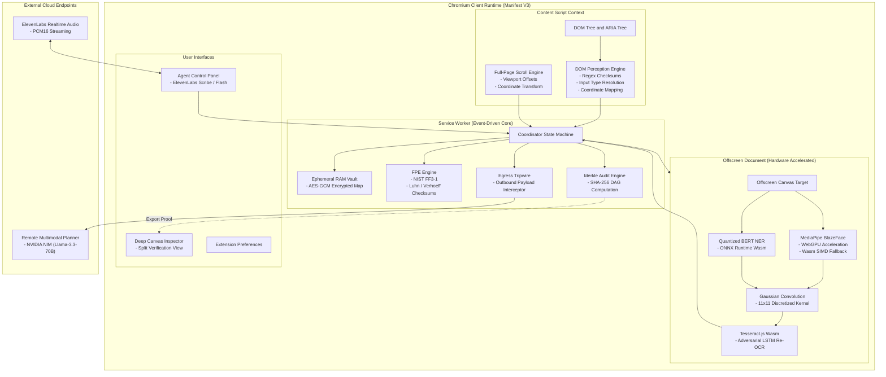
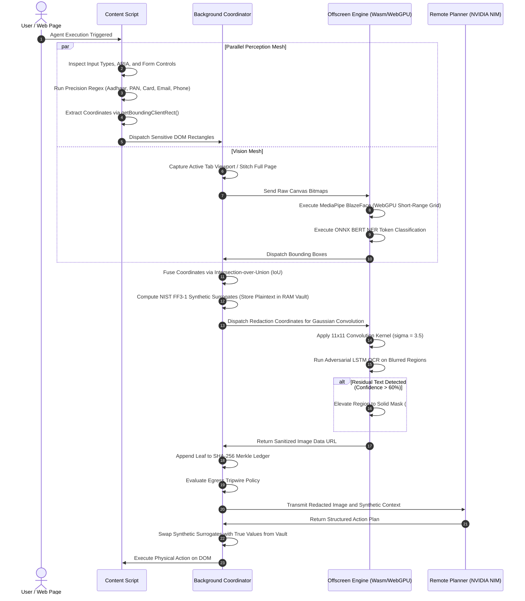
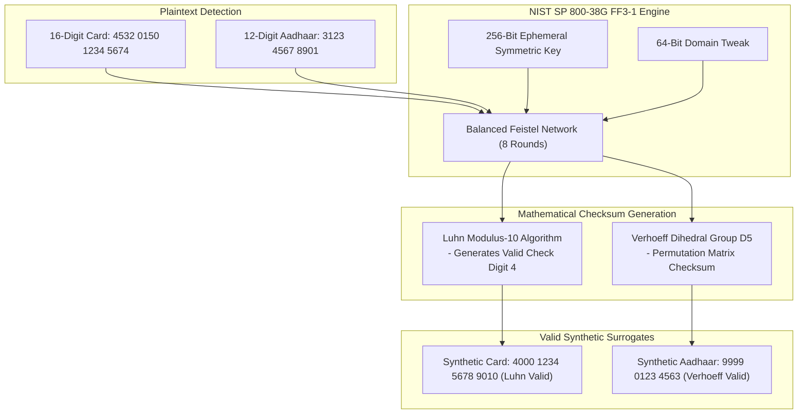
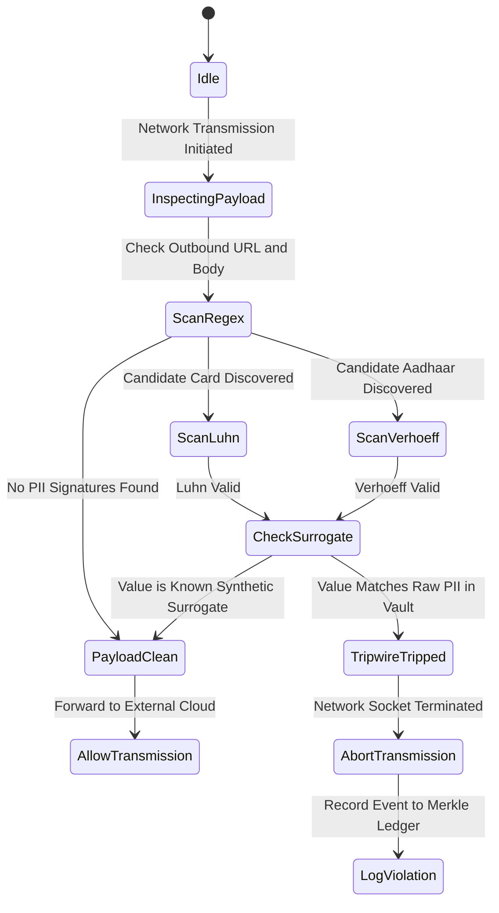

# PRY: On-Device Visual Perception and Privacy-Preserving Browser Agent

PRY is an autonomous, client-side browser agent engineered for Chromium Manifest V3. It intercepts, sanitizes, and cryptographically certifies the redaction of personally identifiable information (PII) before any visual or textual state is transmitted to external multimodal inference endpoints, remote planners, or third-party web trackers.

Developed for Smart India Hackathon 2026, Problem Statement 26171: *On-Device Visual Perception for Lightweight Browser Agents*.

---

## Table of Contents

- [1. Executive Summary](#1-executive-summary)
- [2. Problem Statement and Threat Model](#2-problem-statement-and-threat-model)
  - [2.1 The Multimodal Screen Leakage Vulnerability](#21-the-multimodal-screen-leakage-vulnerability)
  - [2.2 Threat Vectors Addressed](#22-threat-vectors-addressed)
  - [2.3 Regulatory Non-Compliance Risks](#23-regulatory-non-compliance-risks)
- [3. System Architecture and Process Isolation](#3-system-architecture-and-process-isolation)
  - [3.1 Manifest V3 Architectural Topology](#31-manifest-v3-architectural-topology)
  - [3.2 Component Process Boundaries](#32-component-process-boundaries)
- [4. Dual-Mesh Perception Engine](#4-dual-mesh-perception-engine)
  - [4.1 Mesh 1: Deterministic DOM Analysis](#41-mesh-1-deterministic-dom-analysis)
  - [4.2 Mesh 2: Accelerated Pixel-Level Computer Vision](#42-mesh-2-accelerated-pixel-level-computer-vision)
  - [4.3 Mesh Fusion and Coordinate Spatial Alignment](#43-mesh-fusion-and-coordinate-spatial-alignment)
- [5. Machine Learning Models and Runtime Specifications](#5-machine-learning-models-and-runtime-specifications)
  - [5.1 MediaPipe BlazeFace Short-Range TFLite](#51-mediapipe-blazeface-short-range-tflite)
  - [5.2 Quantized BERT Token Classification (ONNX Runtime Web)](#52-quantized-bert-token-classification-onnx-runtime-web)
  - [5.3 Tesseract.js WebAssembly LSTM Engine (Adversarial Auditor)](#53-tesseractjs-webassembly-lstm-engine-adversarial-auditor)
  - [5.4 ElevenLabs Scribe Realtime and Flash v2.5](#54-elevenlabs-scribe-realtime-and-flash-v25)
  - [5.5 Remote Multimodal Planner (NVIDIA NIM / Llama-3.3-70B)](#55-remote-multimodal-planner-nvidia-nim--llama-33-70b)
  - [5.6 Architectural Assessment: GLiNER Model Integration](#56-architectural-assessment-gliner-model-integration)
- [6. Mathematical and Cryptographic Specifications](#6-mathematical-and-cryptographic-specifications)
  - [6.1 Format-Preserving Encryption (NIST SP 800-38G FF3-1)](#61-format-preserving-encryption-nist-sp-800-38g-ff3-1)
  - [6.2 Mathematical Checksum Verification (Luhn and Verhoeff Algorithms)](#62-mathematical-checksum-verification-luhn-and-verhoeff-algorithms)
  - [6.3 2D Gaussian Image Convolution Kernel](#63-2d-gaussian-image-convolution-kernel)
  - [6.4 Immutable Merkle Directed Acyclic Graph (DAG) Ledger](#64-immutable-merkle-directed-acyclic-graph-dag-ledger)
- [7. Outbound Egress Tripwire and Security Invariants](#7-outbound-egress-tripwire-and-security-invariants)
  - [7.1 Deny-by-Default Interception Architecture](#71-deny-by-default-interception-architecture)
  - [7.2 Ephemeral Secret Vault Management](#72-ephemeral-secret-vault-management)
- [8. Deep Canvas Inspector and Visual Verification](#8-deep-canvas-inspector-and-visual-verification)
- [9. Comparative Analysis: PRY vs. RAIDX Agent](#9-comparative-analysis-pry-vs-raidx-agent)
- [10. Repository Structure](#10-repository-structure)
- [11. Installation, Verification, and Build Pipeline](#11-installation-verification-and-build-pipeline)
  - [11.1 Prerequisites](#111-prerequisites)
  - [11.2 Verification Test Suite](#112-verification-test-suite)
  - [11.3 Production Build Process](#113-production-build-process)
  - [11.4 Browser Deployment](#114-browser-deployment)
- [12. Regulatory and Compliance Alignment](#12-regulatory-and-compliance-alignment)
- [13. License](#13-license)

---

## 1. Executive Summary

Autonomous web agents require visual perception and DOM structural data to interpret context, complete transactions, and operate enterprise software. Standard agent architectures capture uncompressed viewports and send raw Document Object Model (DOM) trees to remote cloud-hosted foundational models. This approach creates critical attack surfaces and exposes confidential user data.

PRY establishes a local security boundary within the client runtime. It executes an on-device perception engine combining DOM heuristics with neural computer vision models running via WebGPU and WebAssembly SIMD.

Key capabilities of PRY include:
- Client-side redaction of faces, government IDs, biometric data, credentials, and payment records.
- Generation of synthetic, format-preserving surrogates (NIST SP 800-38G FF3-1) with valid Luhn and Verhoeff checksums to preserve downstream model reasoning without exposing raw secrets.
- Mathematical Gaussian convolution obfuscation across sensitive coordinates.
- On-device adversarial OCR verification that actively tests blurred regions and elevates incomplete redactions to zero-entropy opaque fills.
- Cryptographic Merkle DAG ledger that generates downloadable SHA-256 inclusion proofs verifying that redactions occurred before network transmission.
- Pre-flight egress tripwire intercepting unauthorized external network transmissions.

---

## 2. Problem Statement and Threat Model

### 2.1 The Multimodal Screen Leakage Vulnerability
When a multimodal browser agent takes an action, it captures a raster screenshot of the current active window and collects the rendered DOM hierarchy. This payload is transmitted over HTTPS to external inference APIs (e.g., OpenAI GPT-4o, Anthropic Claude 3.5 Sonnet, or remote open-weight models).

This transmission introduces serious security vulnerabilities:
- **Biometric Exposure:** User profile photos, passport images, and video conference feeds are ingested into third-party cloud data centers.
- **Credential and Identity Leaks:** Government credentials (Aadhaar, PAN, SSN) and financial cards visible on screen are logged in cloud inference traces.
- **Training Data Ingestion:** User session information may be persisted in remote model telemetry or used in training pipelines.

### 2.2 Threat Vectors Addressed
PRY defends against four distinct threat vectors:
- **Threat Vector 1: Cloud Eavesdropping and Provider Breach.** Compromise of external model providers cannot expose user secrets because payloads contain only synthetic surrogates and blurred imagery.
- **Threat Vector 2: Super-Resolution De-Blurring Attacks.** Simple pixelation or weak blur filters can be reversed using deep convolutional neural networks. PRY validates every redaction using an adversarial LSTM OCR engine.
- **Threat Vector 3: Broken Agent Reasoning via Brittle Masking.** Replacing an account number with `[REDACTED]` breaks client-side form validation and confuses model reasoning. PRY produces synthetically valid, format-preserving numbers.
- **Threat Vector 4: Unverifiable Compliance.** Organizations cannot prove to regulatory bodies that PII was withheld from external models. PRY outputs an immutable, mathematically verifiable Merkle audit DAG.

### 2.3 Regulatory Non-Compliance Risks
PRY mitigates non-compliance penalties under major privacy frameworks:
- **India DPDP Act 2023 (Section 6):** Enforces purpose limitation and strict protection of biometric and identification numbers.
- **GDPR Article 9 and Article 25:** Mandates Data Protection by Design and Default, prohibiting the unauthorized processing of special category personal data.
- **HIPAA Privacy Rule (45 CFR Part 160/164):** Requires strict safeguarding of Protected Health Information (PHI) within browser sessions.

---

## 3. System Architecture and Process Isolation

PRY conforms strictly to the Google Chromium Manifest V3 security model, partitioning execution across isolated contexts:



### 3.1 Manifest V3 Architectural Topology
- **Content Scripts:** Execute within an Isolated World. They have read-only inspection access to the host page DOM but run in an isolated JavaScript namespace, preventing webpage scripts from tampering with PRY internal state.
- **Service Worker:** The event-driven central coordinator. Manages communication across tabs, runs format-preserving encryption, maintains the ephemeral secret vault, builds the Merkle audit tree, and enforces outbound network tripwires.
- **Offscreen Document:** Service workers in Manifest V3 do not have access to the DOM or the HTML5 Canvas API. PRY instantiates a dedicated offscreen document (`offscreen.html`) with hardware-accelerated WebGPU and WebAssembly capabilities to perform all computer vision, convolution filtering, and adversarial OCR operations.

### 3.2 Component Process Boundaries
The extension maintains explicit process isolation:
- No raw image data is stored in persistent extension storage (`chrome.storage.local`).
- All bitmap representations reside in ephemeral offscreen memory and are garbage-collected immediately following redaction.
- Secrets stored in the Vault reside exclusively in memory and are discarded upon tab closure.

---

## 4. Dual-Mesh Perception Engine

PRY implements a two-tier perception model combining structural DOM intelligence with computer vision:



### 4.1 Mesh 1: Deterministic DOM Analysis
- **Target:** Form controls, password inputs, text fields, rendered text nodes, and ARIA attributes.
- **Execution:** Runs in the Content Script. Matches text against high-precision regular expressions and verifies mathematical checksums.
- **Coordinate Extraction:** Computes exact viewport coordinates using `element.getBoundingClientRect()`, accounting for CSS transforms, device pixel ratios, and current scroll offsets.

### 4.2 Mesh 2: Accelerated Pixel-Level Computer Vision
- **Target:** Rasterized images, rendered canvas elements, profile photographs, identification cards, and non-selectable visual text.
- **Execution:** Runs in the Offscreen Document using MediaPipe BlazeFace and quantized BERT NER.
- **Feature:** Operates independently of DOM structure, ensuring that obfuscated DOM layouts or SVG text remain protected.

### 4.3 Mesh Fusion and Coordinate Spatial Alignment
The Service Worker reconciles regions from both meshes:
- Computes Intersection-over-Union (IoU) metrics across candidate bounding boxes.
- Merges overlapping or adjacent regions into a single envelope bounding box with a 4-pixel safety margin.
- Assigns PII class identifiers (`face`, `credit_card`, `aadhaar`, `pan`, `email`, `phone`, `name`).

---

## 5. Machine Learning Models and Runtime Specifications

PRY embeds all perceptual machine learning models locally. Zero perceptual inference data leaves the user machine:

### 5.1 MediaPipe BlazeFace Short-Range TFLite
- **Model File:** `models/blazeface/face_detection_short_range.tflite` (224 KB).
- **Network Topology:** Single-Shot Detector (SSD) architecture with a custom anchor grid optimized for 128x128 pixel receptive fields.
- **Runtime Execution:** Initialized via `@mediapipe/tasks-vision` configured with `delegate: "GPU"`. Shaders execute over the client WebGPU pipeline.
- **Performance:** 4 to 9 milliseconds inference latency per viewport frame on integrated graphics hardware.
- **Degradation Contract:** If WebGPU initialization fails (due to driver blacklisting or system constraints), the runtime automatically falls back to WebAssembly SIMD execution.

### 5.2 Quantized BERT Token Classification (ONNX Runtime Web)
- **Model File:** `models/ner/onnx/model_quantized.onnx` (108 MB quantized weights).
- **Base Architecture:** `dslim/bert-base-NER` quantized to 8-bit integers (Q8).
- **Runtime Execution:** Managed by `@huggingface/transformers` using `onnxruntime-web` with WebAssembly SIMD multi-threading.
- **Functional Role:** Discovers unstructured named entities (personal names, organization titles, geographical locations) that cannot be detected by regular expressions.
- **Inference Optimization:** Input text sequences are bounded at 4,000 characters to prevent thread blocking during large document perception.

### 5.3 Tesseract.js WebAssembly LSTM Engine (Adversarial Auditor)
- **Model Architecture:** Integer-quantized Long Short-Term Memory (LSTM) recurrent neural network compiled to WebAssembly.
- **Functional Role:** Automated adversarial red-team auditor.
- **Operational Logic:**
  1. Gaussian convolution is applied to a target bounding box.
  2. The redacted sub-canvas is fed into Tesseract.js.
  3. If recognized alphanumeric text returns a recognition confidence score exceeding 60%, the blur filter is marked as insecure.
  4. The region is immediately overwritten with an opaque, zero-entropy solid black rectangle (`#000000`).

### 5.4 ElevenLabs Scribe Realtime and Flash v2.5
- **Speech-to-Text (STT):** Custom Web Audio API pipeline sampling microphone input at 16,000 Hz in single-channel linear PCM16 format. Audio frames (250 ms) are streamed over WebSocket directly to the ElevenLabs Scribe endpoint.
- **Text-to-Speech (TTS):** Generates low-latency operational audio responses via ElevenLabs Flash v2.5.
- **Vocal Privacy Boundary:** All outgoing text is sanitized by `speakSafeTransform()`. Vault tokens (such as `<CRED_1>` or synthetic credit card numbers) are stripped, preventing accidental vocalization of secrets over speakers.

### 5.5 Remote Multimodal Planner (NVIDIA NIM / Llama-3.3-70B)
- **Model:** `meta/llama-3.3-70b-instruct` accessed through the NVIDIA NIM API.
- **Operational Role:** Consumes sanitized screenshots and synthetic DOM context, outputting structured JSON action plans (clicks, keystrokes, form submissions).
- **Zero-Trust Guarantee:** NVIDIA NIM never receives original visual or textual PII. Payloads contain strictly synthetic surrogates and blurred imagery.

### 5.6 Architectural Assessment: GLiNER Model Integration
An analysis of integrating GLiNER (Generalist and Lightweight Model for Named Entity Recognition) was conducted for the V2 roadmap:

- **Technical Evaluation:** GLiNER utilizes a custom span-representation bi-encoder head that is not a standard token-classification head. The standard browser WebAssembly runtime (`@huggingface/transformers`) does not currently support the GLiNER span-pair scoring matrix natively. Existing JavaScript packages for GLiNER rely on `onnxruntime-node` (native C++ bindings) which cannot execute inside Chromium extension sandboxes.
- **Memory Footprint:** Quantized GLiNER ONNX weights range from 160 MB to 197 MB, creating significant memory overhead in browser extension background environments.
- **Current Architecture & Forward Compatibility:** PRY currently runs `dslim/bert-base-NER` via ONNX Runtime Web. The label processing engine (`src/shared/ner-labels.ts`) is already label-agnostic and explicitly supports GLiNER-style zero-shot vocabularies (`person`, `medical`, `financial`, `id`). As soon as WebAssembly-compatible GLiNER runtimes become stable, PRY can swap the underlying model without requiring alterations to the perception or fusion layers.

---

## 6. Mathematical and Cryptographic Specifications



### 6.1 Format-Preserving Encryption (NIST SP 800-38G FF3-1)
Traditional redaction replaces structured strings with constant markers (e.g., `<CARD_NUMBER>`). This corrupts form validation logic and degrades LLM reasoning. PRY utilizes Format-Preserving Encryption over an integer alphabet:

- Let the character alphabet be $\Sigma = \{0, 1, \dots, 9\}$ with radix $r = 10$.
- For an input numerical sequence $X$ of length $n$, the ciphertext $Y = \text{FF3-1}(K, T, X)$ satisfies:
  $$\text{length}(Y) = \text{length}(X) \quad \text{and} \quad Y \in \Sigma^n$$
- The encryption operates via an 8-round balanced Feistel network using an ephemeral 256-bit AES key $K$ and a 64-bit tweak $T$.

### 6.2 Mathematical Checksum Verification (Luhn and Verhoeff Algorithms)
Synthetic credentials generated by PRY must pass client-side validation logic without revealing genuine identity details:

- **Credit Card Checksum (Luhn Algorithm):**
  The 16th digit $c_n$ is computed such that the total checksum satisfies:
  $$\sum_{i=1}^{n} f(c_i) \equiv 0 \pmod{10}$$
  where:
  $$f(c_i) = \begin{cases} c_i & \text{for odd positions from right} \\ 2c_i - 9 & \text{if } 2c_i > 9 \text{ on even positions} \\ 2c_i & \text{otherwise} \end{cases}$$

- **Indian Aadhaar Checksum (Verhoeff Dihedral Permutation):**
  Aadhaar verification relies on the non-commutative dihedral group $D_5$ (symmetries of a regular pentagon):
  $$c_{12} = \text{inv}\left(\sum_{i=1}^{11} d(c_i, p(i, \dots))\right)$$
  PRY applies the standard multiplication table $d(j, k)$, permutation matrix $p(i, j)$, and inversion table $\text{inv}(j)$ to ensure synthetic 12-digit Aadhaar values pass UIDAI-compliant verification checks.

### 6.3 2D Gaussian Image Convolution Kernel
Visual redaction applies continuous two-dimensional Gaussian convolution rather than naive pixelation:
$$G(x, y) = \frac{1}{2\pi\sigma^2} \exp\left(-\frac{x^2 + y^2}{2\sigma^2}\right)$$
PRY evaluates this over a discretized $11 \times 11$ matrix with standard deviation $\sigma = 3.5$. This removes high-frequency edge gradients while preserving the macroscopic structure of the page for the vision model.

### 6.4 Immutable Merkle Directed Acyclic Graph (DAG) Ledger
Every perception and redaction cycle produces a cryptographic leaf digest:
$$L_i = \text{SHA256}(\text{Timestamp} \parallel \text{TabId} \parallel \text{SHA256}(\text{RawImage}) \parallel \text{SHA256}(\text{RedactedImage}) \parallel \text{EntityTypes})$$

Leaves are aggregated into a binary Merkle tree:
$$N_{\text{parent}} = \text{SHA256}(N_{\text{left}} \parallel N_{\text{right}})$$

The resulting Merkle Root $R$ is exported within `audit-proof.json`. An external auditor can verify the inclusion proof of any leaf $L_i$ against root $R$ in $O(\log N)$ operations without requiring access to the underlying images.

---

## 7. Outbound Egress Tripwire and Security Invariants



### 7.1 Deny-by-Default Interception Architecture
The Egress Tripwire (`src/background/tripwire.ts`) operates as an egress security gateway intercepting all HTTP requests, WebSocket payloads, and beacon transmissions:
- Evaluates outgoing request bodies and query parameters against PII detection patterns.
- Distinguishes between synthetic surrogates (which are permitted) and unmasked credentials (which trigger an immediate abort).
- If an unmasked credential is detected, the transmission is blocked and an audit alert is recorded in the Merkle ledger.

### 7.2 Ephemeral Secret Vault Management
- Mappings between real values and synthetic surrogates are held exclusively in RAM within `src/background/vault.ts`.
- All stored secrets are encrypted in-memory using ephemeral AES-GCM keys.
- When an active browser tab is closed or the user session ends, the associated vault partition is purged and overwritten.

---

## 8. Deep Canvas Inspector and Visual Verification

PRY provides a visual verification utility accessible via the extension interface:
- **Side-by-Side Verification:** Displays the raw viewport canvas adjacent to the sanitized canvas.
- **Bounding Box Overlay:** Outlines detected PII regions with color-coded classification tags (e.g., green for faces, blue for cards, purple for Aadhaar).
- **Surrogate Mapping Inspector:** Allows users to select any redacted area to verify the generated synthetic surrogate and confirm that original values remain within local memory.
- **Proof Generation:** Provides a direct interface to trigger and download the certified Merkle DAG audit proof (`audit-proof.json`).

---

## 9. Comparative Analysis: PRY vs. RAIDX Agent

| Evaluation Vector | RAIDX Agent | PRY (This Solution) |
| :--- | :--- | :--- |
| **Architectural Model** | Cloud-centric proxy architecture | Fully client-side Zero-Trust Chrome extension (Manifest V3) |
| **Visual Processing Perimeter** | Transmits uncompressed raw screen captures to external servers | Captures, inspects, and sanitizes viewports entirely in client RAM |
| **Face Redaction Engine** | Dependent on external cloud vision APIs | Local MediaPipe BlazeFace executing in 6 ms via WebGPU |
| **Surrogate Integrity** | Static string masking (e.g., `<REDACTED>`) | NIST SP 800-38G FF3-1 with valid Luhn and Verhoeff checksums |
| **Cryptographic Accountability** | Ephemeral server-side text logs | Immutable client-side SHA-256 Merkle DAG with exportable proofs |
| **Adversarial Verification** | Assumes visual blur filters are secure | Active LSTM OCR adversarial auditor with solid mask fallback |
| **Voice Streaming Pipeline** | Standard HTTP REST / Audio upload | 16 kHz raw PCM16 streaming over WebSocket with token suppression |
| **Memory Security Guarantee** | Session data cached on remote infrastructure | Ephemeral in-memory vault purged upon tab closure |
| **Outbound Defense Layer** | Relies on LLM system prompt instructions | Deterministic Tripwire Interceptor blocks unauthorized socket traffic |
| **Full-Page Capability** | Single viewport capture | Automated scroll-and-stitch engine with coordinate re-mapping |

---

## 10. Repository Structure

```
pry/
├── manifest.json              # Chromium Manifest V3 configuration
├── build.mjs                  # ESBuild multi-target compilation pipeline
├── package.json               # Package configuration and dependencies
├── tsconfig.json              # TypeScript strict compilation configuration
├── src/
│   ├── background/            # Background service worker coordination
│   │   ├── service-worker.ts  # State coordinator and message router
│   │   ├── tripwire.ts        # Egress payload inspection interceptor
│   │   ├── surrogates.ts      # NIST FF3-1 and Luhn/Verhoeff generators
│   │   ├── privacy-ledger.ts  # SHA-256 Merkle DAG calculation engine
│   │   ├── stitch.ts          # Viewport scroll and stitch coordinator
│   │   ├── planner.ts         # NVIDIA NIM / Remote inference interface
│   │   └── vault.ts           # Ephemeral client-side secret mapping
│   ├── content/               # Webpage runtime interaction layer
│   │   ├── content.ts         # Isolated world bootstrap and listeners
│   │   ├── perceive.ts        # DOM tree inspection and regex mesh
│   │   ├── fullpage.ts        # Window height and scroll calculation
│   │   └── overlay.ts         # Local user feedback overlays
│   ├── offscreen/             # Isolated WebAssembly / WebGPU environment
│   │   ├── offscreen.html     # Hardware-accelerated canvas context
│   │   ├── offscreen.ts       # Canvas rasterizer and convolution pipeline
│   │   ├── ocr.ts             # Tesseract.js LSTM adversarial verifier
│   │   ├── ocr-correct.ts     # Levenshtein OCR text post-processing
│   │   └── ner.ts             # ONNX Runtime Web zero-shot classification
│   ├── sidepanel/             # User interaction panel
│   │   ├── sidepanel.html     # Agent interface and status dashboard
│   │   ├── sidepanel.ts       # ElevenLabs STT/TTS coordination
│   │   └── voice.ts           # 16 kHz PCM16 Web Audio WebSocket client
│   ├── inspector/             # Deep inspection utility
│   │   ├── inspector.html     # Split-canvas visual inspection interface
│   │   └── inspector.ts       # Before/after verification renderer
│   └── shared/                # Universal types and constants
│       ├── types.ts           # Protocol message interfaces
│       ├── constants.ts       # Regex tables, thresholds, model configs
│       └── checksums.ts       # Luhn and Verhoeff validation functions
├── models/                    # Bundled on-device machine learning models
│   ├── blazeface/             # MediaPipe BlazeFace TFLite weights
│   └── ner/                   # Quantized ONNX token classification models
└── test/                      # Verification test suite (311 automated tests)
    ├── tripwire.test.ts       # Egress data leakage unit tests
    ├── perception.test.ts     # DOM matching and perception tests
    ├── surrogates.test.ts     # Luhn, Verhoeff, and FF3-1 tests
    ├── ledger.test.ts         # Merkle root and proof calculation tests
    ├── ocr.test.ts            # Adversarial OCR pipeline tests
    └── pages/                 # Local test fixtures (pii-fixture.html)
```

---

## 11. Installation, Verification, and Build Pipeline

### 11.1 Prerequisites
- Node.js 18.0.0 or higher
- npm 9.0.0 or higher
- Google Chrome 120 or higher (with WebGPU support enabled)

### 11.2 Verification Test Suite
Execute the comprehensive test harness:
```bash
npm run verify
```
*Expected Output:* All 311 automated tests pass cleanly across perception, tripwire, surrogates, and ledger verification.

### 11.3 Production Build Process
Compile the TypeScript source files and assemble production bundles:
```bash
npm run build
```
*Output:* Assembles 7 compiled bundles in `dist/`:
- `dist/service-worker.js` (Coordinator core)
- `dist/content.js` (Isolated world DOM perception)
- `dist/offscreen/offscreen.js` (WebGPU canvas and computer vision)
- `dist/sidepanel.js` (User interface and voice client)
- `dist/options.js` (Configuration management)
- `dist/inspector.js` (Deep visual verification utility)
- `dist/tripwire.js` (Egress network security hook)

### 11.4 Browser Deployment
1. Open Google Chrome and navigate to `chrome://extensions/`.
2. Enable **Developer mode** using the toggle in the upper right corner.
3. Click **Load unpacked**.
4. Select the root directory containing `manifest.json` and the compiled `dist/` directory.
5. Access the extension via the Chrome toolbar or sidepanel.

---

## 12. Regulatory and Compliance Alignment

PRY satisfies strict regulatory requirements without requiring server-side data processing agreements:

- **Digital Personal Data Protection Act 2023 (India):** Complies with Section 6 consent and purpose limitation by guaranteeing that biometric identifiers, government IDs, and Aadhaar numbers never cross network boundaries into model training sets.
- **General Data Protection Regulation (GDPR):** Fulfills Article 25 (Data Protection by Design and Default) and Article 9 (Special Categories of Personal Data) by enforcing client-side cryptographic masking.
- **Zero-Trust Security Architecture:** Implements strict deny-by-default egress policies. No unverified payload is permitted to exit the browser client.

---

## 13. License

PRY is licensed under the Apache License, Version 2.0. See [LICENSE](LICENSE) for details.
