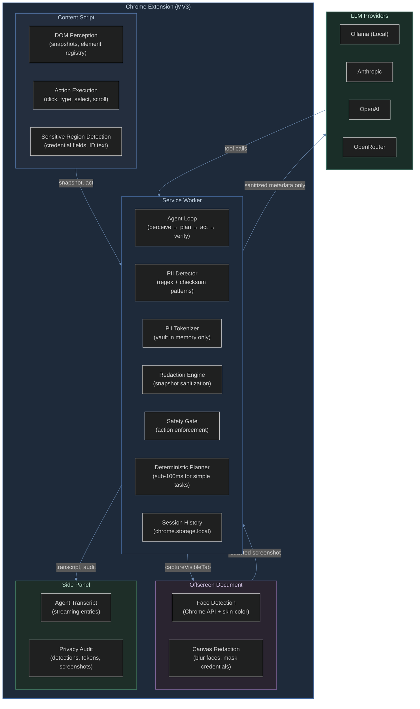
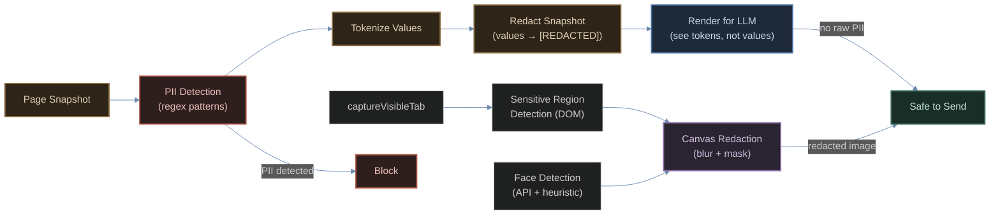

# PRY

**Privacy-preserving browser automation through on-device PII detection and redaction.**

PRY is a Chrome extension that automates browser tasks while protecting personally identifiable information. Every page snapshot is scanned for PII before it reaches any LLM provider. Screenshots are redacted — faces blurred, credentials masked — before anything leaves the device. The agent refuses to type passwords, card numbers, or government IDs into any field.

Built for [Smart India Hackathon 2026](https://sih.gov.in/sih2026PS) Problem Statement 26171: *On-device Visual Perception for Lightweight Browser Agents*.

---

## Table of Contents

- [Overview](#overview)
- [Architecture](#architecture)
- [Privacy Pipeline](#privacy-pipeline)
- [PII Detection](#pii-detection)
- [Agent Loop](#agent-loop)
- [Tech Stack](#tech-stack)
- [Project Structure](#project-structure)
- [Getting Started](#getting-started)
- [What is Next](#what-is-next)
- [License](#license)

---

## Overview

Modern browser agents — Browser Use, Anthropic Computer Use, OpenAI Operator — send full screenshots to cloud servers for processing. These screenshots contain passwords, financial data, personal messages, and identity documents. PRY eliminates this risk by applying a multi-stage privacy pipeline before any data crosses a network boundary.

### Key Capabilities

- **PII Detection** — Regex-based detection for Aadhaar, PAN, IFSC, SSN, passport numbers, credit cards, API keys, and password fields. Every detection is classified by type and confidence.
- **PII Tokenization** — Sensitive values are replaced with opaque tokens (`<CRED_1>`, `<ID_2>`) before the LLM sees them. The vault is held in memory only, resolved at the last moment before action execution.
- **Screenshot Redaction** — The offscreen document captures `captureVisibleTab`, applies DOM-guided masking to credential fields, and detects faces via Chrome FaceDetector API with a skin-color heuristic fallback. Redacted screenshots are JPEG-compressed at 0.85 quality.
- **Safety Gate** — A single enforcement point runs before every action. The agent refuses to type into password fields, blocks values that match PII patterns, and requires user confirmation for irreversible actions (purchases, deletions, submissions).
- **Deterministic Planner** — Simple tasks resolve without any LLM call: click by text match, fill by label, scroll, navigate, press key. Sub-100ms latency for common form interactions.
- **Multi-Provider LLM Support** — Anthropic, OpenAI, OpenRouter, Groq, NVIDIA NIM, and Ollama (local). The agent adapts its system prompt size for small local models to avoid context overflow.
- **Loop Detection** — Tracks recent actions and breaks out when the same action repeats beyond a threshold, preventing infinite loops on unresponsive pages.
- **Session History** — Completed tasks are saved to `chrome.storage.local` with transcripts, PII metrics, and duration for later review.

---

## Architecture



---

## Privacy Pipeline

Every piece of data that might cross a network boundary goes through a five-stage pipeline before transmission. The pipeline runs at every perception step — initial page load, after every action, and on fresh snapshots.



### Stage 1: DOM Snapshot Sanitization

The content script extracts interactive elements into a `PageSnapshot` — element IDs, roles, names, values, and ARIA attributes. Before this snapshot reaches the LLM:

1. `detectAllPII` scans element values and page text for credential fields, API keys, Aadhaar/PAN/SSN/passport patterns, and card numbers.
2. `tokenizer.tokenizeSnapshot` replaces sensitive values with opaque tokens (`<CRED_1>`, `<ID_2>`). The original values are held in an in-memory vault that is cleared when the task ends.
3. `redactSnapshot` replaces tokenized element values with `[REDACTED]` and page text ID patterns with `[ID_REDACTED]`.
4. The rendered snapshot — what the LLM actually sees — contains only tokens, never raw values.

### Stage 2: Screenshot Redaction

When a screenshot is captured via `captureVisibleTab`:

1. The content script's `getSensitiveRegions` identifies bounding boxes for password fields, credential inputs, card number fields, Aadhaar/PAN/SSN fields, and visible ID text in the DOM.
2. The offscreen document receives the screenshot, sensitive regions, and device pixel ratio.
3. DOM-guided redaction applies solid black masks to high-confidence credential regions and Gaussian blur (12px) to general input fields.
4. Face detection runs via Chrome FaceDetector API, falling back to a skin-color heuristic (RGB + normalized RGB rules across diverse skin tones). Detected faces receive Gaussian blur (20px) with 20% bounding box expansion.
5. The redacted image is converted to JPEG at 0.85 quality.

### Stage 3: Token Resolution

Tokens are resolved back to real values only at the last possible moment — when the agent is about to execute an action. The `resolveTokens` function recursively walks the action input, swapping every `<TYPE_N>` token via the vault. If the LLM returns a token that was never issued by the client, the action is rejected as a potential prompt injection.

### Stage 4: Safety Gate

Every action passes through `gate()` before execution:

- **Credential fields** — The agent refuses to type into any field matching password, CVV, card number, Aadhaar, PAN, SSN, passport, IFSC, OTP, or API key patterns.
- **Sensitive values** — The agent refuses to type text matching API key formats, card numbers, Aadhaar/PAN/SSN patterns, or private keys.
- **Irreversible actions** — Click actions matching purchase, send, delete, submit, confirm, transfer, or sign-up patterns require user confirmation.
- **Form submission** — Typing with `submit: true` into a non-search field requires user confirmation.

### Stage 5: Prompt Injection Detection

Page text is scanned for patterns like "ignore previous instructions", "developer mode", "you are now an AI agent", and "jailbreak". When detected, the agent flags it to the user and treats the text as page content, not as an instruction.

---

## PII Detection

| PII Type | Detection Method | Precision |
|----------|-----------------|-----------|
| Aadhaar number | 12-digit pattern (XXXX XXXX XXXX) | ~85% (regex only) |
| PAN card | Format validation (ABCDE1234F) | ~90% (format only) |
| IFSC code | Structural pattern (4 letters + 0 + 6 alphanumeric) | ~90% |
| SSN | Format pattern (XXX-XX-XXXX) | ~85% |
| Passport | Format pattern (1-2 letters + 6-8 digits) | ~80% |
| Credit/Debit card | 16-digit pattern with optional separators | ~85% (regex only) |
| Password fields | DOM `input[type=password]` + field name patterns | ~99% |
| API keys | Format patterns for Anthropic, OpenAI, GitHub, Slack, AWS, JWT | ~95% |
| Face | Chrome FaceDetector API + skin-color heuristic | ~90% |
| Phone (Indian) | 10-digit pattern starting with 6-9 | ~80% |
| Email | Standard regex pattern | ~90% |

Detection runs in the service worker for DOM/text PII and in the offscreen document for visual PII (faces). The safety gate provides a second layer of enforcement at action-execution time.

---

## Agent Loop

The agent operates in a perceive-plan-act-verify cycle:

1. **Perceive** — Extract a `PageSnapshot` from the content script. Apply the full privacy pipeline (detect, tokenize, redact). For local models, cap element count to 30 (80 for cloud models).
2. **Plan** — On step 0, the deterministic planner attempts to resolve the task without an LLM. If it fails or the task is complex, the LLM planner (Anthropic, OpenAI, OpenRouter, Groq, NVIDIA NIM, or local Ollama) generates tool calls. The system prompt is shorter for local models (`SYSTEM_PROMPT_LOCAL`, ~180 tokens) to avoid context overflow.
3. **Act** — Each tool call passes through the safety gate. Element IDs are validated against the current snapshot. Tokens are resolved from the vault. The action executes via the content script (page actions) or Chrome APIs (navigation, tabs).
4. **Verify** — After any action that may have changed the page, a fresh snapshot is captured. The privacy pipeline runs again. If the agent repeats the same action 3 times within 5 steps, it stops with a loop detection error.

### Provider Adaptation

The agent detects `provider === "ollama"` and applies several adaptations for local models:

- Shorter system prompt (`SYSTEM_PROMPT_LOCAL` vs `SYSTEM_PROMPT`)
- Smaller snapshot element cap (30 vs 80)
- Extended timeouts (120s request, 30s per chunk)
- Tool-calling fallback (retry without tools if model returns 403)

---

## Tech Stack

| Layer | Technology | Purpose |
|-------|-----------|---------|
| Extension framework | Manifest V3 | Service worker, offscreen document, side panel |
| Build | esbuild | Fast bundling with TypeScript |
| UI | Vanilla JS (minified) | Side panel with Hallmark Custom-04 broadsheet design |
| DOM extraction | Native DOM APIs | Page snapshot extraction (~10ms) |
| Face detection | Chrome FaceDetector API + skin-color heuristic | On-device face detection for screenshot redaction |
| PII detection | Regex + checksum-gated validation (Verhoeff / Luhn) | Aadhaar, PAN, IFSC, SSN, passport, card numbers, API keys |
| Redaction | OffscreenCanvas | Blur faces, mask credentials in screenshots |
| Tokenization | In-memory vault | PII replaced with `<TYPE_N>` tokens, resolved at execution time |
| LLM planning | Anthropic / OpenAI / OpenRouter / Groq / NVIDIA NIM / Ollama | Multi-provider with streaming and automatic fallback |
| Deterministic planner | Custom engine | Click-by-text, fill-by-label, scroll, navigate, press-key |
| Safety gate | Pattern-matching enforcement | Blocks credential typing, confirms irreversible actions |
| Storage | chrome.storage.local | Settings, session history |
| Type safety | TypeScript 5.6 | End-to-end type checking |
| Testing | Node headless harness (esbuild + assert) | Pipeline, tripwire black-box, OCR verification, wire log, ML fusion (300+ assertions) |

---

## Project Structure

```
src/
  background/
    agent.ts              Agent loop (perceive → plan → act → verify)
    deterministic.ts      Offline planner for simple tasks
    executor.ts           TabController + action routing
    history.ts            Session history (chrome.storage.local)
    pii-detector.ts       Regex-based PII detection engine
    prompt.ts             System prompts (full + local model variant)
    redaction.ts          Snapshot redaction (DOM values → [REDACTED])
    safety.ts             Safety gate (action enforcement)
    service-worker.ts     Orchestrator: messages, screenshots, audit
    tokenizer.ts          PII tokenization vault (in-memory only)
    tools.ts              Agent action surface (14 tools)
    providers/
      anthropic.ts        Anthropic adapter
      index.ts            Provider factory
      ollama.ts           Ollama adapter (local, streaming)
      openai.ts           OpenAI + OpenRouter adapter
      types.ts            Shared planner types
  content/
    act.ts                Action execution (click, type, select, scroll)
    content.ts            Content script message handler
    perceive.ts           DOM snapshot extraction + sensitive region detection
    screenshot.ts         Placeholder (capture handled by service worker)
  offscreen/
    offscreen.ts          Canvas redaction + face detection (OffscreenCanvas)
  sidepanel/
    index.html            Side panel markup
    sidepanel.ts          Transcript, audit display, controls
    styles.css            Hallmark Custom-04 broadsheet design
  shared/
    models.ts             Provider metadata + model listing
    types.ts              Wire types, settings, normalization
```

---

## Getting Started

### Prerequisites

- Node.js 18+
- npm
- Google Chrome 120+

### Installation

```bash
# Clone the repository
git clone https://github.com/shashank-tomar0/pry.git
cd pry

# Install dependencies
npm install

# Build the extension
npm run build
```

### Loading the Extension

1. Open `chrome://extensions/`
2. Enable "Developer mode"
3. Click "Load unpacked"
4. Select the `dist` directory
5. The PRY icon appears in your toolbar

### Optional: Local LLM (Ollama)

```bash
# Install Ollama
curl -fsSL https://ollama.ai/install.sh | sh

# Pull a model
ollama pull qwen2.5:1.5b
```

The extension auto-detects Ollama when it is running on `localhost:11434`.

### Optional: Cloud LLM

Open the extension options page and add an API key for Anthropic, OpenAI, or OpenRouter. The agent uses the selected provider for planning.

---

## Release Status (v1.0)

What is documented above is what ships and is verified end-to-end by `npm run
verify` (300+ assertions: privacy pipeline, re-OCR pixel proof, MAIN-world
tripwire scanner, checksum validation, learning loop). Of the original roadmap:

### Shipped and verified in v1.0
- **Checksum-gated PII validation** — Verhoeff (Aadhaar), Luhn (cards), format
  validation (PAN/IFSC). Regex lookalikes become measured false positives, not
  over-redaction.
- **MAIN-world egress tripwire** — hooks `fetch`/XHR/`sendBeacon` in the page's
  real world; intercepts are aggregated into one live EGRESS WATCH entry with a
  full per-request log in the radar drawer. Card matches require a real BIN
  prefix; nothing fires inside hex hashes or alphanumeric tokens.
- **Re-OCR verification** — after redaction, the exact shipped JPEG is re-OCR'd
  with locally-vendored Tesseract; leaks flip the audit chip to WARNING.
- **Synthetic semantic surrogates** — redacted credentials are replaced with
  mathematically-valid dummy values (Verhoeff/Luhn) so VLMs keep layout.
- **Self-improvement loop** — experience memory, reflection, learned rules
  (false positives, misses, repeated-success strategy rules), immutable privacy
  ledger, and a live dashboard.
- **Egress accounting** — every byte sent to a remote planner is counted and
  shown honestly in the toolbar badge; local-only (Ollama) runs show 0.

### Still on the roadmap (not shipped — no fake claims)
- **On-device vision models** — Florence-2 / PP-OCR / ONNX page understanding
  (the `models/` directory is reserved for these; today's perception is DOM +
  screenshot redaction + optional provider VLM, never raw pixels).
- **In-page PII badge overlay** — a floating count chip on the page itself.
- **Adaptive prompt compression** — context-budget-aware snapshot trimming.
- **Session replay** — step-by-step playback of a completed run.

These remain future work precisely so the shipped feature set stays honest:
nothing in v1.0 depends on files that are not bundled in `dist/`.

## License

MIT
