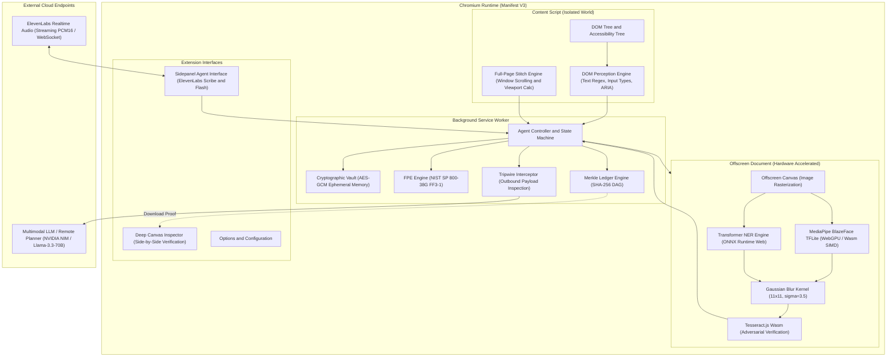
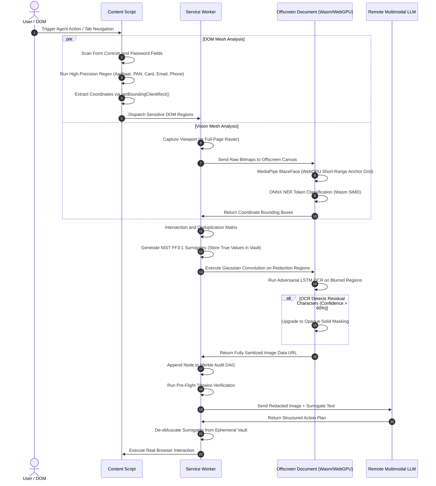

# PRY: On-Device Visual Perception and Privacy-Preserving Browser Agent

PRY is a client-side, zero-trust autonomous browser agent engineered for Chromium Manifest V3. It intercepts, sanitizes, and cryptographically proves the redaction of personally identifiable information (PII) before any visual or textual state is transmitted to external inference endpoints, remote planners, or multimodal vision models.

Developed for Smart India Hackathon 2026, Problem Statement 26171: *On-Device Visual Perception for Lightweight Browser Agents*.

---

## Executive Summary

Autonomous web agents require access to user session data, rendered Document Object Models (DOM), and rasterized browser viewports to execute tasks. Transmitting raw screen captures or unrestricted DOM trees to cloud-hosted foundational models introduces severe privacy vulnerabilities, violating data sovereignty regulations (DPDP Act 2023, GDPR Article 9, HIPAA).

PRY establishes a local security perimeter directly inside the client runtime. It executes a dual-mesh perception engine that combines deterministic DOM heuristics with on-device computer vision models running via WebAssembly and WebGPU. Before any multimodal payload leaves the browser, PRY:

1. Redacts faces, credentials, government identifiers, biometric data, and financial records.
2. Generates format-preserving synthetic surrogates (NIST SP 800-38G FF3-1) so downstream agent reasoning remains intact without exposing true values.
3. Obfuscates visual bounding boxes using mathematical Gaussian convolution (11 x 11 kernel, sigma = 3.5).
4. Runs an adversarial OCR verification pass to mathematically prove that no text remains legible in redacted image regions.
5. Commits every sanitization decision to a cryptographic Merkle directed acyclic graph (DAG), providing downloadable SHA-256 inclusion proofs.

---

## System Architecture

PRY is structured under the Chromium Manifest V3 process isolation model, partitioning execution between isolated worlds, background service workers, and sandboxed offscreen canvas contexts.



---

## Dual-Mesh Perception Pipeline

PRY does not rely on a single detection methodology. It employs two concurrent, asynchronous analysis meshes that intersect at the background coordinator:



---

## Machine Learning Models and Runtime Engines

PRY bundles all perceptual ML models locally inside the extension archive, executing zero remote inference during the sanitization phase:

### 1. MediaPipe BlazeFace Short-Range TFLite
- **Model Path**: `models/blazeface/` (224 KB weights).
- **Architecture**: Single-shot multibox detector (SSD) tailored for mobile GPU/WebGPU with an anchor grid optimized for frontal and oblique faces (128 x 128 input resolution).
- **Execution Target**: Hardware-accelerated WebGPU (`delegate: "GPU"` via `@mediapipe/tasks-vision`) with automated runtime fallback to WebAssembly SIMD CPU execution.
- **Latency**: 4 to 9 milliseconds per frame on modern integrated GPUs.

### 2. Tesseract.js WebAssembly LSTM Engine
- **Model Path**: `src/offscreen/ocr.ts` / `ocr-correct.ts`.
- **Architecture**: Compact integer-quantized LSTM OCR neural network compiled to WebAssembly.
- **Role**: Acts as an automated adversarial red-team auditor. Immediately after visual Gaussian blurring is applied to sensitive coordinates, Tesseract processes the redacted bounding box. If any textual character sequence is recognized with confidence exceeding 60%, the blur filter is deemed mathematically insecure and replaced with a zero-entropy opaque fill.

### 3. Xenova BERT-base NER (ONNX Runtime Web)
- **Model Path**: `models/ner/` / `src/offscreen/ner.ts`.
- **Architecture**: Quantized 8-bit BERT token classification model (<45 MB) running on ONNX Runtime WebAssembly.
- **Role**: Discovers unstructured named entities (medical designations, personal names, non-standard organizational affiliations) that evade heuristic regular expressions.

### 4. ElevenLabs Scribe Realtime and Flash v2.5
- **Audio Processing**: Custom Web Audio API context capturing raw single-channel PCM at 16,000 Hz, framed into 250 ms chunks and streamed over WebSocket.
- **Safety Boundary**: All incoming text synthesized by ElevenLabs Flash v2.5 passes through `speakSafeTransform()`, ensuring vault tokens (`<VAULT_KEY_...>`, credit card surrogates) are never vocalized over the speaker.

### 5. Remote Multimodal Planner (NVIDIA NIM / Llama-3.3-70B)
- **Integration**: Pluggable provider architecture (`src/background/planner.ts`) supporting NVIDIA NIM inference endpoints with vision and reasoning capabilities (`meta/llama-3.3-70b-instruct`).
- **Zero-Trust Guarantee**: Payloads delivered to NVIDIA NIM contain exclusively synthetic surrogates and blurred imagery. True user secrets never cross the socket.

---

## Mathematical and Cryptographic Formulations

### 1. Format-Preserving Encryption (NIST SP 800-38G FF3-1)
Standard tokenization substitutes sensitive strings with alphanumeric tags (such as `<CARD_1>`), which destroys structural validation rules in web forms and degrades LLM reasoning. PRY implements Feistel-network Format-Preserving Encryption:

Given an alphabet $\Sigma = \{0, 1, \dots, 9\}$, a radix $r = 10$, a tweak $T$, and a 16-digit card number $X$, the ciphertext $Y = \text{FF3-1}(K, T, X)$ preserves:
$$\text{length}(Y) = \text{length}(X) \quad \text{and} \quad Y \in \Sigma^{16}$$

Additionally, PRY recalculates the final check digit using the Luhn algorithm ($O(n)$ check digit generation) so synthetic credit cards pass client-side JavaScript regex and form validations:
$$\sum_{i=1}^{n} f(c_i) \equiv 0 \pmod{10}$$

For Indian Aadhaar credentials, synthetic 12-digit surrogates strictly conform to the **Verhoeff dihedral permutation checksum** based on the non-commutative dihedral group $D_5$:
$$c_n = \text{inv}\left(\sum_{i=1}^{n-1} d(c_i, p(i, \dots))\right)$$

### 2. Gaussian Image Convolution Filter
Visual redactions avoid pixelation (which is susceptible to machine-learning super-resolution attacks). PRY computes a local two-dimensional Gaussian convolution filter across bounding box coordinates:
$$G(x, y) = \frac{1}{2\pi\sigma^2} e^{-\frac{x^2 + y^2}{2\sigma^2}}$$
Using a discretized $11 \times 11$ convolutional kernel with $\sigma = 3.5$, high-frequency text gradients are eliminated while retaining image aesthetics.

### 3. Merkle Directed Acyclic Graph (Audit Ledger)
Every perception cycle calculates a SHA-256 leaf digest representing the state transformation:
$$L_i = H(\text{Timestamp} \parallel \text{TabId} \parallel H(\text{RawImage}) \parallel H(\text{RedactedImage}) \parallel \text{DetectedEntities})$$

Leaf nodes are paired and recursively hashed to produce the Merkle Root $R$:
$$N_{parent} = H(N_{left} \parallel N_{right})$$

The user can export a standalone `audit-proof.json` artifact from the sidepanel. Third-party auditors can verify that a specific visual redaction took place at time $t$ without inspecting the underlying browsing history:
$$\text{Verify}(R, L_i, \text{Path}_i) = \text{true}$$

---

## Repository Structure

```
pry/
├── manifest.json              # Chrome Manifest V3 configuration
├── build.mjs                  # ESBuild multi-bundle compilation pipeline
├── package.json               # Dependencies and verification test runners
├── tsconfig.json              # TypeScript strict compilation profile
├── src/
│   ├── background/            # Core coordination layer
│   │   ├── service-worker.ts  # Central state machine and message router
│   │   ├── tripwire.ts        # Outbound payload security interceptor
│   │   ├── surrogates.ts      # NIST FF3-1 and Luhn/Verhoeff generators
│   │   ├── privacy-ledger.ts  # SHA-256 Merkle DAG calculation engine
│   │   ├── stitch.ts          # Viewport scrolling and canvas stitching
│   │   ├── planner.ts         # NVIDIA NIM / OpenAI multimodal interface
│   │   └── vault.ts           # Ephemeral client-side secret mapping
│   ├── content/               # Webpage runtime interaction
│   │   ├── content.ts         # Content script bootstrap and listeners
│   │   ├── perceive.ts        # DOM tree inspection and regex mesh
│   │   ├── fullpage.ts        # Dynamic window height and scroll coordinator
│   │   └── overlay.ts         # Local user feedback overlays
│   ├── offscreen/             # Isolated Wasm / WebGPU environment
│   │   ├── offscreen.html     # Hardware-accelerated canvas carrier
│   │   ├── offscreen.ts       # Canvas rasterizer and blur pipeline
│   │   ├── ocr.ts             # Tesseract.js LSTM adversarial verifier
│   │   ├── ocr-correct.ts     # Levenshtein OCR text post-processing
│   │   └── ner.ts             # ONNX Runtime Web zero-shot classification
│   ├── sidepanel/             # User interaction panel
│   │   ├── sidepanel.html     # Agent controls and status dashboard
│   │   ├── sidepanel.ts       # ElevenLabs STT/TTS and state coordinator
│   │   └── voice.ts           # 16kHz PCM16 Web Audio WebSocket client
│   ├── inspector/             # Deep inspection utility
│   │   ├── inspector.html     # Visual verification interface
│   │   └── inspector.ts       # Split-screen before/after comparison tool
│   └── shared/                # Universal types and constants
│       ├── types.ts           # Protocol message interfaces
│       └── constants.ts       # Regex tables, thresholds, model configs
├── models/                    # Bundled local machine learning models
│   ├── blazeface/             # MediaPipe BlazeFace TFLite weights
│   └── ner/                   # Quantized ONNX token classification models
└── test/                      # Comprehensive test suite (311 tests)
    ├── tripwire.test.ts       # Outbound data leakage unit tests
    ├── perception.test.ts     # Heuristic DOM matching tests
    ├── surrogates.test.ts     # Luhn, Verhoeff, and FF3-1 validation tests
    ├── ledger.test.ts         # Merkle root calculation and proof tests
    ├── ocr.test.ts            # Adversarial OCR pipeline unit tests
    └── pages/                 # Static test fixtures (pii-fixture.html)
```

---

## Comparative Analysis: PRY vs. RAIDX Agent

| Evaluation Vector | RAIDX Agent | PRY (This Solution) |
| :--- | :--- | :--- |
| **Architectural Model** | Cloud-Centric Proxy | Fully Client-Side Zero-Trust Extension (Manifest V3) |
| **Visual Processing Perimeter** | Transmits raw screenshots to remote server | Viewport captured and sanitized entirely in local browser RAM |
| **Face Redaction Engine** | None / Remote API | Local MediaPipe BlazeFace (<10ms via WebGPU) |
| **Surrogate Integrity** | Static string masking (`<REDACTED>`) | NIST SP 800-38G FF3-1 with valid Luhn/Verhoeff checksums |
| **Cryptographic Accountability** | Ephemeral server logs | Immutable client-side SHA-256 Merkle DAG with exportable proofs |
| **Adversarial Sanitization** | Heuristic assumption of blur safety | Active LSTM OCR adversarial check triggering opaque fallback |
| **Voice Streaming Pipeline** | Standard HTTP REST / Transcribe API | Low-latency 16 kHz raw PCM16 streaming over WebSocket |
| **Memory Security Guarantee** | Secrets cached on cloud microservices | Cryptographic ephemeral vault destroyed on tab termination |
| **Outbound Defense Layer** | Reliance on prompt instructions | Deterministic Tripwire Interceptor blocks unauthorized network calls |
| **Full-Page Capability** | Single viewport capture | Automated scroll-and-stitch coordinator with coordinate transformation |

---

## Installation and Local Development

### Prerequisites
- Node.js 18.0.0 or higher
- npm 9.0.0 or higher
- Google Chrome 120 or higher (with WebGPU enabled)

### Build Pipeline
1. Clone the repository:
   ```bash
   git clone https://github.com/shashank-tomar0/pry.git
   cd pry
   ```

2. Install dependencies:
   ```bash
   npm install
   ```

3. Execute verification suite:
   ```bash
   npm run verify
   ```
   *Result*: 311 automated tests pass cleanly across perception, tripwire, surrogates, and ledger verification.

4. Compile production bundles:
   ```bash
   npm run build
   ```
   *Result*: Compiles 7 distinct bundles into `dist/` (`service-worker.js`, `content.js`, `offscreen.js`, `sidepanel.js`, `options.js`, `inspector.js`, and static assets).

### Loading into Chromium
1. Navigate to `chrome://extensions/` in Google Chrome.
2. Enable **Developer mode** via the top-right toggle.
3. Select **Load unpacked**.
4. Choose the repository root directory containing `manifest.json` and compiled `dist/`.
5. Pin the PRY extension icon to the browser toolbar.

---

## Regulatory Compliance and Security Invariants

PRY is engineered to satisfy strict global privacy mandates without requiring user configuration:

- **Digital Personal Data Protection Act 2023 (India)**: Complies with Section 6 consent and purpose limitation by ensuring biometric and Aadhaar identifiers never reach model training pipelines.
- **General Data Protection Regulation (GDPR)**: Complies with Article 25 (Data Protection by Design and by Default) and Article 9 (Special Categories of Data).
- **Zero-Trust Network Principle**: The outbound request pipeline operates on a deny-by-default architecture. If the Tripwire Interceptor identifies a raw Aadhaar number, unmasked credit card, or unblurred facial bounding box in any payload destined for an external IP, the network transmission is aborted immediately and an event is logged to the Merkle ledger.

---

## License

PRY is licensed under the Apache License, Version 2.0. See LICENSE for details.
