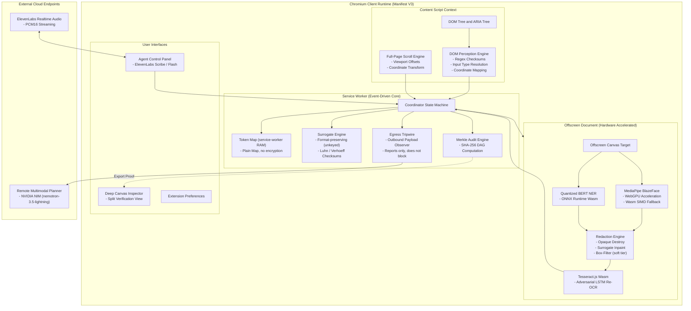
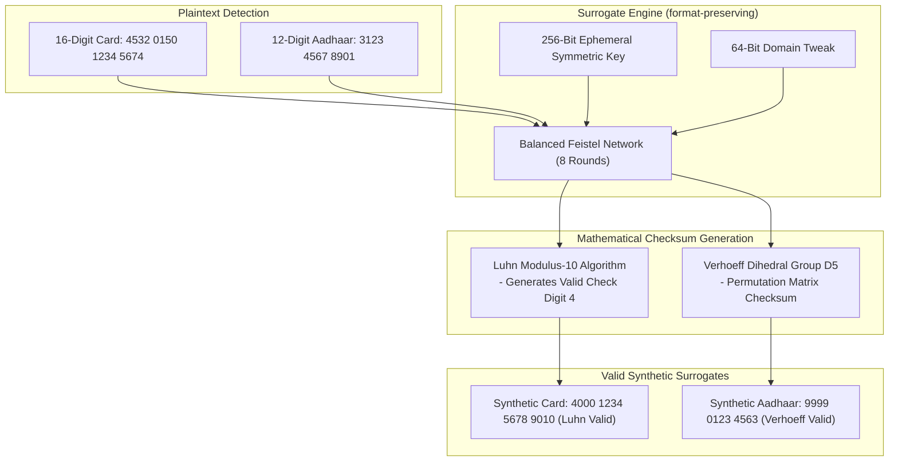
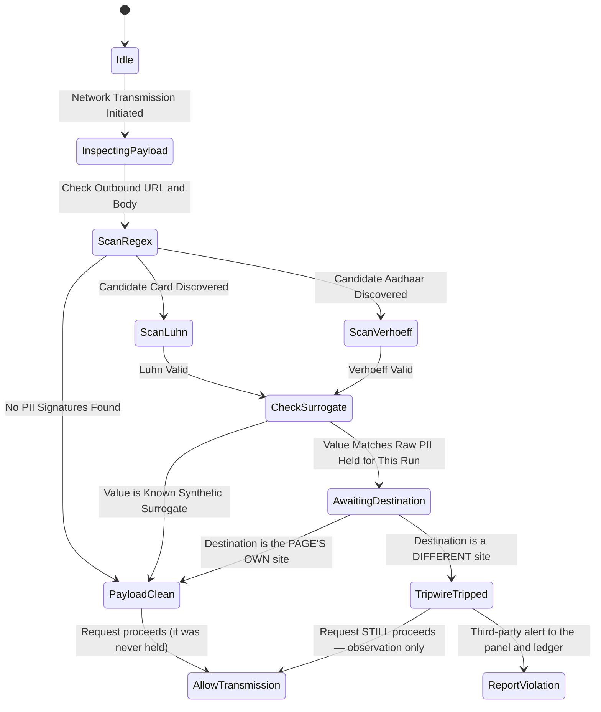

# PRY: On-Device Visual Perception and Privacy-Preserving Browser Agent

PRY is an autonomous, client-side browser agent engineered for Chromium Manifest V3. It intercepts, sanitizes, and cryptographically certifies the redaction of personally identifiable information (PII) before any visual or textual state is transmitted to external multimodal inference endpoints, remote planners, or third-party web trackers.

Developed for Smart India Hackathon 2026, Problem Statement 26171: *On-Device Visual Perception for Lightweight Browser Agents*.

---

## Table of Contents

- [1. Executive Summary](#1-executive-summary)
- [2. Problem Statement and Threat Model](#2-problem-statement-and-threat-model)
  - [2.1 The Multimodal Screen Leakage Vulnerability](#21-the-multimodal-screen-leakage-vulnerability)
  - [2.2 Threat Vectors Addressed](#22-threat-vectors-addressed)
  - [2.3 Regulatory Non-Compliance Risks](#23-regulatory-non-compliance-risks)
- [3. System Architecture and Process Isolation](#3-system-architecture-and-process-isolation)
  - [3.1 Manifest V3 Architectural Topology](#31-manifest-v3-architectural-topology)
  - [3.2 Component Process Boundaries](#32-component-process-boundaries)
- [4. Dual-Mesh Perception Engine](#4-dual-mesh-perception-engine)
  - [4.1 Mesh 1: Deterministic DOM Analysis](#41-mesh-1-deterministic-dom-analysis)
  - [4.2 Mesh 2: Accelerated Pixel-Level Computer Vision](#42-mesh-2-accelerated-pixel-level-computer-vision)
  - [4.3 Mesh Fusion and Coordinate Spatial Alignment](#43-mesh-fusion-and-coordinate-spatial-alignment)
- [5. Machine Learning Models and Runtime Specifications](#5-machine-learning-models-and-runtime-specifications)
  - [5.1 MediaPipe BlazeFace Short-Range TFLite](#51-mediapipe-blazeface-short-range-tflite)
  - [5.2 Quantized BERT Token Classification (ONNX Runtime Web)](#52-quantized-bert-token-classification-onnx-runtime-web)
  - [5.3 Tesseract.js WebAssembly LSTM Engine (Adversarial Auditor)](#53-tesseractjs-webassembly-lstm-engine-adversarial-auditor)
  - [5.4 ElevenLabs Scribe Realtime and Flash v2.5](#54-elevenlabs-scribe-realtime-and-flash-v25)
  - [5.5 Remote Multimodal Planner (NVIDIA NIM)](#55-remote-multimodal-planner-nvidia-nim)
  - [5.6 Architectural Assessment: GLiNER Model Integration](#56-architectural-assessment-gliner-model-integration)
- [6. Mathematical and Cryptographic Specifications](#6-mathematical-and-cryptographic-specifications)
  - [6.1 Format-Preserving Surrogate Generation (hash-derived, not FF3-1)](#61-format-preserving-surrogate-generation-hash-derived-not-ff3-1)
  - [6.2 Mathematical Checksum Verification (Luhn and Verhoeff Algorithms)](#62-mathematical-checksum-verification-luhn-and-verhoeff-algorithms)
  - [6.3 Visual Redaction Tiers and the Reversibility Test](#63-visual-redaction-tiers-and-the-reversibility-test)
  - [6.4 Immutable Merkle Directed Acyclic Graph (DAG) Ledger](#64-immutable-merkle-directed-acyclic-graph-dag-ledger)
- [7. Outbound Egress Tripwire and Security Invariants](#7-outbound-egress-tripwire-and-security-invariants)
  - [7.1 Observational Egress Monitoring (not interception)](#71-observational-egress-monitoring-not-interception)
  - [7.2 Ephemeral Secret Vault Management](#72-ephemeral-secret-vault-management)
- [8. Deep Canvas Inspector and Visual Verification](#8-deep-canvas-inspector-and-visual-verification)
- [9. Comparative Analysis: PRY vs. RAIDX Agent](#9-comparative-analysis-pry-vs-raidx-agent)
- [10. Repository Structure](#10-repository-structure)
- [11. Installation, Verification, and Build Pipeline](#11-installation-verification-and-build-pipeline)
  - [11.1 Prerequisites](#111-prerequisites)
  - [11.2 Verification Test Suite](#112-verification-test-suite)
  - [11.3 Production Build Process](#113-production-build-process)
  - [11.4 Browser Deployment](#114-browser-deployment)
- [12. Regulatory and Compliance Alignment](#12-regulatory-and-compliance-alignment)
- [13. License](#13-license)

---

## 1. Executive Summary

Autonomous web agents require visual perception and DOM structural data to interpret context, complete transactions, and operate enterprise software. Standard agent architectures capture uncompressed viewports and send raw Document Object Model (DOM) trees to remote cloud-hosted foundational models. This approach creates critical attack surfaces and exposes confidential user data.

PRY establishes a local security boundary within the client runtime. It executes an on-device perception engine combining DOM heuristics with neural computer vision models running via WebGPU and WebAssembly SIMD.

Key capabilities of PRY include:
- Client-side redaction of detected faces, government IDs, biometric data, credentials, and payment records.
- Deterministic format-preserving surrogates: the replacement keeps the original's length, character classes, and checksum validity (Luhn for cards, Verhoeff for Aadhaar), so downstream validation and model reasoning survive the swap. The generator is a hash-derived, Feistel-style digit mapping — **not** a NIST SP 800-38G FF3-1 cipher (see §6.1).
- Irreversible destruction of detected faces: the region is overwritten with an opaque fill. Deliberately NOT a blur — blur is a recoverable low-pass filter. Detection is best-effort across three local channels (BlazeFace, Chrome's shape detector, and a skin-colour pass that exists specifically to catch the thumbnail-sized faces a short-range model misses). The guarantee is irreversibility of what is detected; it is not a claim of complete detection.
- On-device adversarial OCR verification of the exact bytes that ship: every redacted region is re-read from the post-JPEG frame, and the frame is rebuilt with those regions destroyed if any readable character survives. The proof covers the regions PRY redacted — it is not evidence that it detected everything on the page.
- Tamper-evident SHA-256 ledger with an exportable Merkle root and full leaf list (`audit-proof.json`), verifying that the recorded redactions occurred in order before transmission.
- Pre-flight egress tripwire observing the page's own outbound payloads and reporting PII-shaped sends, separating the site's own backend traffic from genuine third-party egress. **It reports; it does not block** (§7.1).

---

## 2. Problem Statement and Threat Model

### 2.1 The Multimodal Screen Leakage Vulnerability
When a multimodal browser agent takes an action, it captures a raster screenshot of the current active window and collects the rendered DOM hierarchy. This payload is transmitted over HTTPS to external inference APIs (e.g., OpenAI GPT-4o, Anthropic Claude 3.5 Sonnet, or remote open-weight models).

This transmission introduces serious security vulnerabilities:
- **Biometric Exposure:** User profile photos, passport images, and video conference feeds are ingested into third-party cloud data centers.
- **Credential and Identity Leaks:** Government credentials (Aadhaar, PAN, SSN) and financial cards visible on screen are logged in cloud inference traces.
- **Training Data Ingestion:** User session information may be persisted in remote model telemetry or used in training pipelines.

### 2.2 Threat Vectors Addressed
PRY defends against four distinct threat vectors:
- **Threat Vector 1: Cloud Eavesdropping and Provider Breach.** Compromise of external model providers cannot expose user secrets because payloads contain only synthetic surrogates and opaque, zero-entropy masks. No original pixel of a redacted region is transmitted, so there is nothing in the payload to reconstruct.
- **Threat Vector 2: Super-Resolution De-Blurring Attacks.** Simple pixelation and weak blur filters are recoverable: super-resolution deanonymization reconstructs Gaussian-blurred faces, and deconvolution inverts a known blur kernel. PRY therefore does not rely on blur for biometric identifiers. Faces are destroyed with an opaque fill, and any soft-tier region that the adversarial OCR auditor can still read is escalated to an opaque fill before the image ships.
- **Threat Vector 3: Broken Agent Reasoning via Brittle Masking.** Replacing an account number with `[REDACTED]` breaks client-side form validation and confuses model reasoning. PRY produces synthetically valid, format-preserving numbers.
- **Threat Vector 4: Unverifiable Compliance.** Organizations cannot prove to regulatory bodies that PII was withheld from external models. PRY outputs an immutable, mathematically verifiable Merkle audit DAG.

### 2.3 Regulatory Non-Compliance Risks
PRY mitigates non-compliance penalties under major privacy frameworks:
- **India DPDP Act 2023 (Section 6):** Enforces purpose limitation and strict protection of biometric and identification numbers.
- **GDPR Article 9 and Article 25:** Mandates Data Protection by Design and Default, prohibiting the unauthorized processing of special category personal data.
- **HIPAA Privacy Rule (45 CFR Part 160/164):** Requires strict safeguarding of Protected Health Information (PHI) within browser sessions.

---

## 3. System Architecture and Process Isolation

PRY conforms strictly to the Google Chromium Manifest V3 security model, partitioning execution across isolated contexts:



### 3.1 Manifest V3 Architectural Topology
- **Content Scripts:** Execute within an Isolated World. They have read-only inspection access to the host page DOM but run in an isolated JavaScript namespace, preventing webpage scripts from tampering with PRY internal state.
- **Service Worker:** The event-driven central coordinator. Manages communication across tabs, generates format-preserving surrogates, maintains the in-memory token map, builds the Merkle audit tree, and enforces outbound network tripwires.
- **Offscreen Document:** Service workers in Manifest V3 do not have access to the DOM or the HTML5 Canvas API. PRY instantiates a dedicated offscreen document (`offscreen/index.html`) with hardware-accelerated WebGPU and WebAssembly capabilities to perform all computer vision, convolution filtering, and adversarial OCR operations.

### 3.2 Component Process Boundaries
The extension maintains explicit process isolation:
- No raw image data is stored in persistent extension storage (`chrome.storage.local`).
- All bitmap representations reside in ephemeral offscreen memory and are garbage-collected immediately following redaction.
- Token↔value mappings live only in the service worker's heap: never written to `chrome.storage`, and cleared when the worker is torn down (§7.2). Not encrypted, not partitioned per tab.

---

## 4. Dual-Mesh Perception Engine

PRY implements a two-tier perception model combining structural DOM intelligence with computer vision:

```mermaid
sequenceDiagram
    autonumber
    actor User as User / Web Page
    participant CS as Content Script
    participant SW as Background Coordinator
    participant OS as Offscreen Engine (Wasm/WebGPU)
    participant LLM as Remote Planner (NVIDIA NIM)

    User->>CS: Agent Execution Triggered
    par Parallel Perception Mesh
        CS->>CS: Inspect Input Types, ARIA, and Form Controls
        CS->>CS: Run Precision Regex (Aadhaar, PAN, Card, Email, Phone)
        CS->>CS: Extract Coordinates via getBoundingClientRect()
        CS->>SW: Dispatch Sensitive DOM Rectangles
    and Vision Mesh
        SW->>SW: Capture Active Tab Viewport / Stitch Full Page
        SW->>OS: Send Raw Canvas Bitmaps
        OS->>OS: Execute MediaPipe BlazeFace (WebGPU Short-Range Grid)
        OS->>OS: Execute ONNX BERT NER Token Classification
        OS->>SW: Dispatch Bounding Boxes
    end

    SW->>SW: Fuse Coordinates via Intersection-over-Union (IoU)
    SW->>SW: Compute Format-Preserving Surrogates (Plaintext Kept in the In-Memory Token Map)
    SW->>OS: Dispatch Redaction Coordinates
    OS->>OS: Faces -> Opaque Destroy; Text PII -> Solid Mask; Fields -> Surrogate / Soft Blur
    OS->>OS: Run Adversarial LSTM OCR Over the Redacted Regions
    alt Any Readable PII Survives
        OS->>OS: Rebuild Frame From Original: Every Region Opaque (#000000), Re-encode, Re-verify
    end
    OS->>SW: Return Sanitized Image Data URL
    SW->>SW: Append Leaf to SHA-256 Merkle Ledger
    SW->>SW: Evaluate Egress Tripwire Policy
    SW->>LLM: Transmit Redacted Image and Synthetic Context
    LLM->>SW: Return Structured Action Plan
    SW->>SW: Swap Synthetic Surrogates with True Values from the Token Map
    SW->>CS: Execute Physical Action on DOM
```

### 4.1 Mesh 1: Deterministic DOM Analysis
- **Target:** Form controls, password inputs, text fields, rendered text nodes, and ARIA attributes.
- **Execution:** Runs in the Content Script. Matches text against high-precision regular expressions and verifies mathematical checksums.
- **Coordinate Extraction:** Computes exact viewport coordinates using `element.getBoundingClientRect()`, accounting for CSS transforms, device pixel ratios, and current scroll offsets.

### 4.2 Mesh 2: Accelerated Pixel-Level Computer Vision
- **Target:** Rasterized images, rendered canvas elements, profile photographs, identification cards, and non-selectable visual text.
- **Execution:** Runs in the Offscreen Document using MediaPipe BlazeFace and quantized BERT NER.
- **Feature:** Operates independently of DOM structure, ensuring that obfuscated DOM layouts or SVG text remain protected.

### 4.3 Mesh Fusion and Coordinate Spatial Alignment
The Service Worker reconciles regions from both meshes:
- Computes Intersection-over-Union (IoU) metrics across candidate bounding boxes.
- Merges overlapping or adjacent regions into a single envelope bounding box with a 4-pixel safety margin.
- Assigns PII class identifiers (`face`, `credit_card`, `aadhaar`, `pan`, `email`, `phone`, `name`).

---

## 5. Machine Learning Models and Runtime Specifications

PRY embeds all perceptual machine learning models locally. Zero perceptual inference data leaves the user machine:

### 5.1 MediaPipe BlazeFace Short-Range TFLite
- **Model File:** `models/blazeface/face_detection_short_range.tflite` (224 KB).
- **Network Topology:** Single-Shot Detector (SSD) architecture with a custom anchor grid optimized for 128x128 pixel receptive fields.
- **Runtime Execution:** Initialized via `@mediapipe/tasks-vision` configured with `delegate: "GPU"`. Shaders execute over the client WebGPU pipeline.
- **Performance:** 4 to 9 milliseconds inference latency per viewport frame on integrated graphics hardware.
- **Degradation Contract:** If WebGPU initialization fails (due to driver blacklisting or system constraints), the runtime automatically falls back to WebAssembly SIMD execution.

### 5.2 Quantized BERT Token Classification (ONNX Runtime Web)
- **Model File:** `models/ner/onnx/model_quantized.onnx` (108 MB quantized weights).
- **Base Architecture:** `dslim/bert-base-NER` quantized to 8-bit integers (Q8).
- **Runtime Execution:** Managed by `@huggingface/transformers` using `onnxruntime-web` with WebAssembly SIMD multi-threading.
- **Functional Role:** Discovers unstructured named entities (personal names, organization titles, geographical locations) that cannot be detected by regular expressions.
- **Inference Optimization:** Input text sequences are bounded at 4,000 characters to prevent thread blocking during large document perception.

### 5.3 Tesseract.js WebAssembly LSTM Engine (Adversarial Auditor)
- **Model Architecture:** Integer-quantized Long Short-Term Memory (LSTM) recurrent neural network compiled to WebAssembly.
- **Functional Role:** Automated adversarial red-team auditor that both detects and REMEDIATES weak redactions.
- **Operational Logic:**
  1. Each redacted region is cropped from the EXACT bytes that will be shipped (the post-JPEG image) and composited into one strip.
  2. Tesseract.js re-reads that strip. Scanning only the pipeline's own redacted crops is what keeps the check honest: PII legitimately visible elsewhere on the page (an email in an inbox row) is not a leak.
  3. If any PII pattern still reads out of a region, the auditor does not merely warn. The whole frame is rebuilt from the untouched original pixels with every region destroyed (`#000000`), re-encoded, and re-verified.
  4. Only the rebuilt image is allowed to reach the model, so a proven-insufficient redaction cannot ship.
- **Pixel-level companion check:** independently of OCR, each region is compared against its pre-redaction pixels. Faces must come back near-uniformly opaque; a merely "changed" face region fails, because a change is not the same as irreversibility.

### 5.4 ElevenLabs Scribe Realtime and Flash v2.5
- **Speech-to-Text (STT):** Custom Web Audio API pipeline sampling microphone input at 16,000 Hz in single-channel linear PCM16 format. Audio frames (250 ms) are streamed over WebSocket directly to the ElevenLabs Scribe endpoint.
- **Microphone permission:** the side panel calls `getUserMedia` directly, so the manifest must declare `audioCapture`. Chrome requires it for extension pages, and without it the device list is hidden from the extension and the failure surfaces as `NotFoundError: Requested device not found` — a hardware-sounding error for a manifest problem. If the mic reports a failure, the panel now names the actual cause (missing permission, no input device, a blocked prompt, or a device held by another app) instead of echoing Chrome's message; the check is `chrome.runtime.getManifest().permissions`, so it cannot be wrong about which case it is.
- **Text-to-Speech (TTS):** Generates low-latency operational audio responses via ElevenLabs Flash v2.5.
- **Vocal Privacy Boundary:** All outgoing speech is decided in one place, `voice-core.toSpeakable()`. It replaces vault tokens (such as `<CRED_1>` or synthetic credit card numbers) with the spoken word "redacted", flattens markdown, and caps length — so a secret is never vocalized. A token is a reason to **redact, never a reason to refuse**: the previous `speak()` guard checked for a token first and returned an error before that transform ran, so any answer quoting one back (the Gmail tab title alone carries `<CRED_1>`) produced "Refusing to speak: raw vault token in assistant text" instead of audio. The number of tokens spoken as "redacted" is reported, so a substitution is never mistaken for the model's own wording.

### 5.5 Remote Multimodal Planner (NVIDIA NIM)
- **Model:** provider-configurable; the shipped default is `nvidia/nemotron-3.5-lightning-30b-a3b` through the NVIDIA NIM API (see `src/shared/models.ts`).
- **Operational Role:** Consumes sanitized screenshots and synthetic DOM context, outputting structured JSON action plans (clicks, keystrokes, form submissions).
- **Zero-Trust Intent:** the planner receives tokenized text and, when vision is enabled, the post-redaction frame rather than the raw one. This is a policy the pipeline enforces, not a proof: detectors have the failure modes listed in §6.5, so treat "no PII reached the model" as conditional on those detectors firing. Vision is off by default.

#### 5.5.1 Planner turn policy: how a slow or looping turn is bounded

A remote planner is a network service, and the failure mode that matters to the user is not a crash — it is a turn that never ends, or one that ends in junk presented as an answer. One planner turn (`agent.ts`) is bounded by **silence, not by wall clock**, because a reasoning model that is visibly making progress must be allowed to finish:

| Boundary | Budget | What it catches |
| :--- | :--- | :--- |
| First output | 60 s warm / 90 s cold | A provider that never sends its first token. Reported once, **not** retried — two 90 s silent attempts measured on NVIDIA NIM produced 180 s of dead waiting and the same error. |
| Mid-turn silence | 30 s | A dropped connection after output started. Retried once. |
| Deliberation | 12 000 reasoning chars or 90 s | A model reasoning without converging. Steered once ("act now, with what you already have"), then reported. |
| Degeneration | 4-gram short-cycle ratio ≥ 0.5, or a 40-word block repeated 3× | A model that has collapsed into a **repetition loop**. Deltas keep arriving, so no silence window can see this, and it is the one failure that used to run to the ceiling — measured live at 100 s against `nvidia/nemotron-3.5-lightning-30b-a3b`, which collapsed into "can make it one big things. can make it." for 6 233 characters. Cut in seconds, never retried, and the loop is **not** replayed in the next turn's history. |
| Ceiling | 210 s | The absolute bound on one turn (below Manifest V3's 5-minute limit). |

Two properties of this policy are deliberate and worth stating: the check reads **repetition, not duration**, because duration cannot tell a thorough model from a looping one; and every cut is **announced with its reason** — a withheld or stopped turn is narrated, never silent. Assistant text is also clamped (`MAX_HISTORY_TEXT_CHARS` = 1 200) before it is replayed as history, because the model's own monologue comes back to it on every later turn and an unbounded one is paid for repeatedly. Its precision is pinned in the harness against the verbatim reported loop, PRY's own system prompt, long narration, and an adversarial table of near-identical rows.

#### 5.5.2 The frame pipeline: two waiting policies, one implementation

The local pixel pipeline (capture → redact → verify → attack → record) is 1.2 s for a 1× viewport and up to 6.5 s at the 6-tile triage cap. Whether that sits in front of the next planner turn depends on exactly one question — **does the planner read the frame?**

| Vision | Who reads the frame | Policy |
| :--- | :--- | :--- |
| **OFF** (default) | Nobody. The output is local evidence: the ledger entry, the audit panel, the run's PII totals, its re-OCR leak findings | Started and **not awaited**. It runs alongside the planner turn that follows and is joined after that turn returns (measured free: the capture is 1.2-6.5 s, the turn is seconds to minutes) |
| **ON** | The planner, via the VLM's description of the redacted frame | Awaited before the next turn |

Three properties make this safe rather than merely faster, and each is pinned in `agent-frame-audit-test` against the real loop:

- **Nothing is lost by deferring.** The evidence line still reaches the planner, one step later, labelled `[Frame after the previous action: N PII redacted]` / `[Opening frame: …]` — never silently mixed into the page read below it, which is from a later moment. The ledger entry, the audit record, the run's totals and its leak evidence are all unaffected.
- **Nothing is lost when there is nowhere to deliver it.** A turn with no tool call (a final answer, a refusal, Stop) has no tool result to carry the joined line, so it is reported as its own transcript entry instead of being dropped.
- **Every wait is bounded by one budget** (`FRAME_AUDIT_WAIT_MS`, 15 s, over 2× the measured worst case). A capture that wedges — which is how the opening frame could hang a run *before its first planner turn*, with nothing on screen to explain it — is given up on, announced ("did not finish within 15s — continuing without a visual description"), and left to finish its own ledger entry in the background. When the planner does read the frame, the run waits for it — but never indefinitely.

One implementation serves the opening frame, the post-action frame and the deferred half of both; before this it was three copies of the same ~55-line block, which is how a fix lands in one and not the others.

### 5.6 Architectural Assessment: GLiNER Model Integration
An analysis of integrating GLiNER (Generalist and Lightweight Model for Named Entity Recognition) was conducted for the V2 roadmap:

- **Technical Evaluation:** GLiNER utilizes a custom span-representation bi-encoder head that is not a standard token-classification head. The standard browser WebAssembly runtime (`@huggingface/transformers`) does not currently support the GLiNER span-pair scoring matrix natively. Existing JavaScript packages for GLiNER rely on `onnxruntime-node` (native C++ bindings) which cannot execute inside Chromium extension sandboxes.
- **Memory Footprint:** Quantized GLiNER ONNX weights range from 160 MB to 197 MB, creating significant memory overhead in browser extension background environments.
- **Current Architecture & Forward Compatibility:** PRY currently runs `dslim/bert-base-NER` via ONNX Runtime Web. The label processing engine (`src/shared/ner-labels.ts`) is already label-agnostic and explicitly supports GLiNER-style zero-shot vocabularies (`person`, `medical`, `financial`, `id`). As soon as WebAssembly-compatible GLiNER runtimes become stable, PRY can swap the underlying model without requiring alterations to the perception or fusion layers.

---

## 6. Mathematical and Cryptographic Specifications



### 6.1 Format-Preserving Surrogate Generation (hash-derived, not FF3-1)
Traditional redaction replaces structured strings with constant markers (e.g., `<CARD_NUMBER>`). This corrupts form validation logic and degrades LLM reasoning. PRY therefore keeps the FORMAT and substitutes the value:

- Let the character alphabet be $\Sigma = \{0, 1, \dots, 9\}$ with radix $r = 10$.
- For an input numerical sequence $X$ of length $n$, the surrogate $Y$ satisfies:
  $$\text{length}(Y) = \text{length}(X) \quad \text{and} \quad Y \in \Sigma^n$$
- **What the implementation actually is.** `src/background/surrogates.ts` derives each surrogate digit from an FNV-1a digest of the raw value and recomputes the trailing checksum (Luhn / Verhoeff), preserving length, the card BIN prefix, and a synthetic Aadhaar prefix. It is deterministic pseudonymization with no key: not an 8-round AES Feistel FF3-1 cipher.
- **Why that distinction is stated here rather than glossed.** Because the mapping is unkeyed, anyone who can see a surrogate can brute-force the small digit space (a card body is ≤ 11 unknown digits) offline and recover the original. Surrogates ship to a vision model when VLM vision is enabled, so this is a real, narrow weakness rather than a naming quibble. Replacing the generator with a keyed FF3-1 (WebCrypto AES as the round function) is on the roadmap; until then, prefer the opaque mask path for anything that must not be recoverable.

### 6.2 Mathematical Checksum Verification (Luhn and Verhoeff Algorithms)
Synthetic credentials generated by PRY must pass client-side validation logic without revealing genuine identity details:

- **Credit Card Checksum (Luhn Algorithm):**
  The 16th digit $c_n$ is computed such that the total checksum satisfies:
  $$\sum_{i=1}^{n} f(c_i) \equiv 0 \pmod{10}$$
  where:
  $$f(c_i) = \begin{cases} c_i & \text{for odd positions from right} \\ 2c_i - 9 & \text{if } 2c_i > 9 \text{ on even positions} \\ 2c_i & \text{otherwise} \end{cases}$$

- **Indian Aadhaar Checksum (Verhoeff Dihedral Permutation):**
  Aadhaar verification relies on the non-commutative dihedral group $D_5$ (symmetries of a regular pentagon):
  $$c_{12} = \text{inv}\left(\sum_{i=1}^{11} d(c_i, p(i, \dots))\right)$$
  PRY applies the standard multiplication table $d(j, k)$, permutation matrix $p(i, j)$, and inversion table $\text{inv}(j)$ to ensure synthetic 12-digit Aadhaar values pass UIDAI-compliant verification checks.

### 6.3 Visual Redaction Tiers and the Reversibility Test

PRY does not use one redaction for everything, because the tiers have different reversibility properties. Each region is assigned by kind:

| Tier | Applied to | Mechanism | Reversible? |
| :--- | :--- | :--- | :--- |
| **Opaque destroy** | Faces; PII spans in page text | Entire region overwritten with `#000000` | No — zero original pixels survive |
| **Surrogate inpaint** | Confirmed credential / ID fields | Region cleared and repainted with a synthetic, checksum-valid value | No — original pixels are discarded, not filtered |
| **Soft box filter** | Generic input fields, credential labels | Separable sliding-window box average (radius 6, capped at 40) | Weak by design, and accepted only for non-identifying regions |

Two properties matter more than the filter itself:

- **Separability and cost.** The soft tier is implemented as two 1-D sliding-window passes (horizontal then vertical) over an `ImageData` buffer, so cost is $O(w \cdot h)$ independent of radius. It is computed with an explicit window rather than `ctx.filter = "blur(…)"`, which silently no-ops on some Chrome builds and would leave a region untouched while appearing to redact it.
- **Reversibility is attacked, not assumed.** A box average is a low-pass operation and is invertible in principle given the kernel, so the soft tier is never the last word. Faces are excluded from it entirely (blur is the known-recoverable case for biometric identifiers), and `verifyRegions()` rejects any face region that is merely altered rather than near-uniformly opaque. Two adversarial probes then attack the bytes that are about to ship (`src/background/redaction-attack.ts`), and either one rebuilds the frame with every region opaque before it can leave the browser:

  1. **Reconstruction.** Every soft-tier region is sharpened (unsharp mask, an explicit attempt to invert the blur) and the *residual* edge energy is measured: how much of the region's original structure survived the filter. Opaque fills read `0.00`; the blur the pipeline ships reads `0.05–0.26`; a blur whose radius has been weakened reads `0.29–0.97`. A residual at or above `0.35` is judged recoverable and escalated. **Why residual and not "how much did sharpening bring back":** iterated unsharp *manufactures* energy at a mask edge — three passes drive a well-destroyed region's reading above the sharp original — so a gain-based gate opened on every frame and escalated all of them to solid black. **The honest limit:** the shipped and weakened ranges touch (a radius-6 blur on coarse content retains `0.20`, a weakened radius-3 blur starts at `0.21`), so this is a coarse regression guard, not a meter. It reliably catches a blur that silently no-ops, loses its `* scale` factor, or is optimised down to ~2; it cannot resolve a marginal weakening, and separating those needs a real deconvolution rather than a gradient heuristic.
  2. **Face coverage.** The model detector is re-run over the *shipped* frame — a face the original pass missed (detection is not deterministic across a redaction pass, and a face beside a black mask is exactly the case the visual channels were fixed for) is by definition unboxed in the audit's region list. Any detection that a destroyed region covers less than 50% of is a coverage failure rather than a weak mask: it is added to the rebuild's region list, painted, reported as a detection, and re-verified like any other region. The skin-colour channel is deliberately excluded from this probe — its false-positive rate would escalate innocent regions on the strength of a colour histogram.

  The result is recorded per frame as `verification.attack` (`ran`, `reconstructableRegions`, `uncoveredFaces`, `details`) and surfaced in both the Privacy Audit panel and the Deep Inspector, so "attacked and clean" is visibly different from "not attacked" — a pass that cannot be told apart from no pass is evidence of nothing. An escalated frame is labelled `ESCALATED + VERIFIED`, not as a plain pass: the fact that the first paint was insufficient is the most audit-relevant thing about it.

**Every residual says which channel found it.** A residual count alone was ambiguous — a frame reporting "13 residual detection(s)" could not be told apart from thirteen pixel failures, thirteen OCR labels, or a mixture, which made the number undiagnosable. Every entry now carries its source (`PIXEL:`, `OCR:`, `RECONSTRUCTION:`, `FACE COVERAGE:`), and "still present in the bytes that ship" (`leakedPatterns`, which must reach zero for a frame to send) is kept strictly separate from "what triggered the rebuild" (`escalationReasons`, rendered in the panel) — conflating them would have left `residualDetections` above zero and withheld the frame forever.

**A surrogate region is never OCR-checked.** The re-read exists to catch a *soft* region still holding the user's text. A surrogate region holds none of it by construction — PRY discarded the original and painted a synthetic stand-in — and those stand-ins are designed to satisfy the very patterns the scan looks for: the synthetic card `4111 8703 3161 1545` matches **both** "Card number" and "Aadhaar number", and the synthetic email and phone match too. Every frame containing a masked credential field therefore reported ~4 phantom leaks, failed its own mask verification, and (once escalation existed) rebuilt the whole frame black for no reason. Excluding the tier costs no coverage: a surrogate that failed to paint is caught directly by the pixel check, which sees an unchanged region. `ocrCheckableRegions` is the single rule, and it is pinned both as a unit and differentially on the strip the module actually composites.

**What the proof covers.** `verifyRegions()` answers exactly one question: *are the regions PRY chose to redact actually unrecoverable in the bytes that ship?* It cannot answer whether PRY chose the right regions — a face no channel detected, or an email no pattern matched, is invisible to it. Those are different guarantees, and the panel's badge now says so: a green frame means "everything redacted here is opaque", not "this frame contains no PII". Detection completeness is bounded by the three face channels, the regex/checksum matchers, and the on-device NER model, each with the failure modes documented in §6.5. Treat the badge as necessary, never sufficient.

The verifier's own pixel sampling uses a row-phase-offset stride rather than a fixed one: a stride that shares a factor with the content's period (a fixed stride of 4 over an alternating two-tone pattern) lands on a single phase and reads as perfectly flat, which would declare a region blank and skip its redaction.

### 6.4 Immutable Merkle Directed Acyclic Graph (DAG) Ledger
Every perception and redaction cycle produces a cryptographic leaf digest:
$$L_i = \text{SHA256}(\text{Timestamp} \parallel \text{TabId} \parallel \text{SHA256}(\text{RawImage}) \parallel \text{SHA256}(\text{RedactedImage}) \parallel \text{EntityTypes})$$

Leaves are aggregated into a binary Merkle tree:
$$N_{\text{parent}} = \text{SHA256}(N_{\text{left}} \parallel N_{\text{right}})$$

The resulting Merkle Root $R$ is exported within `audit-proof.json` together with every leaf's hash and the full entry list. **Exported today:** root + leaves, so an auditor recomputes $R$ from the leaves in $O(N)$ and detects any edited or reordered entry. **Not exported yet:** per-leaf sibling paths, so there is no $O(\log N)$ inclusion proof to hand a single leaf to a third party — that is a roadmap item, not a current capability.

### 6.5 Detection Coverage and Known Gaps

PRY's redaction is only as good as its detection, so the bounds are stated here rather than left for a judge to discover. Every row is a real limitation of the shipped code, not a hypothetical.

| Channel | Covers | Known failure modes |
| :--- | :--- | :--- |
| **Regex + checksum matchers** (`pii-detector.ts`, `text-pii-patterns.ts`) | Emails, Indian phone numbers, Aadhaar (Verhoeff-validated), PAN, IFSC, SSN, card numbers (Luhn-validated), honorific/cue-phrase names, API keys and JWTs | Anything unstructured: plain names without a cue phrase, street addresses, dates of birth, medical terms, account balances. Lookalikes that fail a checksum are deliberately NOT redacted (measured as a false-positive signal instead). |
| **Contextual analysis** (`contextual-pii.ts`) | Values in fields whose own label marks them sensitive | Needs a readable label; a bare "Account number" box on an icon-only form is not covered. |
| **On-device NER** (token classification, `ml/ner.ts`) | Person names, organizations, locations in page prose, any casing | Bounded to 12 spans per page and to the labels in `ner-labels.ts`; the model is ~104 MB and quantized, so recall on rare or non-Latin names is imperfect; a page whose text is longer than the snapshot budget (`MAX_TEXT` = 6000 chars, `MAX_ELEMENTS` = 80) is scored only on the visible main-content region. |
| **Face channels** (BlazeFace → Chrome shape detector → skin colour, `offscreen.ts`) | Faces in the captured frame, down to roughly 28 px | The model channels run first and the skin-colour pass is now a SUPPLEMENT rather than a fallback: a single BlazeFace hit used to skip it entirely, which is how a page with one large portrait and a grid of thumbnails destroyed the portrait and shipped every thumbnail face. Short-range BlazeFace still misses small faces on its own, the skin-colour heuristic can miss unusual lighting and add false positives on photos, and supplementary additions are capped at 8 per frame so a photo wall cannot blot the page. A separate DOM channel marks `img[alt~=profile|avatar|photo]` and similar as `kind: "face"`; that matches URL/alt text, so it misses most modern avatars (YouTube's `yt3.ggpht.com` images carry neither word). **There is no biometric completeness guarantee** — a missed face is not detected, and the re-OCR verifier does not look for faces at all. |
| **Text-PII pixel boxes** (`perceive.ts#locateSpans` / `location of detector values`) | Rendered text nodes, form fields, avatar images, and the elements the detectors read values out of (`locate-elements`) | Scan is capped (1.5 s, 8 000 nodes, 200 regions) and skips off-viewport matches, so a very heavy page redacts what it reaches before the budget, not everything. A detected value that cannot be located anywhere is now reported explicitly (masked) rather than silently assumed covered. |
| **Images and canvas-rendered text** | Text baked into an ``, a `<canvas>` (PDF viewers, Google Docs), a video frame or a photographed document, when frame-text triage runs | Closed by reading the frame back: `ocr-pii-triage.ts` runs on the ALREADY-REDACTED frame with the bundled Tesseract, matches what it can still read against the shared PII patterns and the spans the NER already found, and black-boxes those words (`image_text` regions). Running it after redaction is what makes it self-targeting — a DOM-redacted value is a black rectangle OCR cannot read, so anything legible there is by definition what no other channel covered. Remaining limits, all real: a name inside an image that the NER never saw anywhere on the page has no pattern to match; OCR misreads are missed; a very tall frame is triaged top-down over at most 6 slices of 900 px, and the shortfall is logged rather than implied covered; and disabling **Scan Frame Text** in Options returns this row to *nothing*. |
| **Region collection failure** | — | If the page's main thread does not answer within the bounded round trip, text PII for that frame is NOT redacted (faces still are). The run emits an explicit warning entry naming the reason instead of silently shipping the frame. |
| **Task-text tokenization** (`tokenizer.ts#tokenizeTask`) | Secrets in the user's own request — card numbers, Aadhaar, emails, keys, one-time codes — plus names that appear as a MESSAGE PAYLOAD ("send an email to Priya Sharma", "addressed to Acme Corporation", "name: …") | Names used as the ordinary object of a preposition in a non-messaging task now ride to the planner **raw**: "go to Priya Sharma's profile", "suggest me to Harkirat Singh". This is a deliberate trade, and it was bought with a real bug. The rule used to treat a bare preposition as an addressee and capture an unbounded letter run, so `"i want to open harkirat singh yt channel"` vaulted the string `"open harkirat singh yt channel"` and handed the planner `<PII_1>` where its search target should have been — the agent then typed the token's own spelling into the search box. In a task, the name is the INSTRUCTION PARAMETER: an instruction the agent cannot read is not a protected instruction, it is a broken one. Names are still tokenized where they are payloads, still redacted in every page/DOM channel, and still detected by NER on screen. Single-word names after a preposition ("forward to John") are not tokenized either, for the same reason a bare preposition is not context. |

---

## 7. Outbound Egress Tripwire and Security Invariants



### 7.1 Observational Egress Monitoring (not interception)
The Egress Tripwire (`src/content/tripwire.ts`) hooks the page's `fetch`, `XMLHttpRequest` and `navigator.sendBeacon` in the MAIN world and inspects outbound URLs and bodies:
- Evaluates outgoing request bodies and query parameters against PII detection patterns (cards, Aadhaar, PAN, email).
- Distinguishes between synthetic surrogates (PRY's own redaction values) and raw values.
- Classifies the DESTINATION: a request to the page's own registrable domain is same-site traffic (a site posting to its own backend), while a different domain is third-party egress. Only the latter raises the third-party alarm; same-site sends are still listed in the radar, labelled.

**What it does not do, stated plainly:** it does not block, cancel, delay or rewrite any request. Every hook calls through to the original unchanged and fails open, and no alert terminates a connection. An earlier revision of this section described a "Deny-by-Default" gateway that aborts transmissions and terminates sockets; no such code has ever existed in this repository. Treat the tripwire as a detector and an audit trail for egress the page performed, not as a firewall. Blocking third-party requests correctly requires a declarative rule the browser enforces (for example a `declarativeNetRequest` filter), which is roadmap rather than shipped behaviour.

- Alerts are recorded in the privacy ledger and surfaced as one aggregated egress entry plus a per-request radar log.

### 7.2 Ephemeral Secret Vault Management
- Token↔value mappings are held in RAM only, inside the service worker's tokenizer vault (`src/background/tokenizer.ts`). Nothing about a vault entry is written to `chrome.storage`.
- **These values are not encrypted at rest in memory, and the vault is not partitioned or purged per tab.** They live in a plain `Map` for the life of the service worker, which is what makes tokenization fast enough to run per snapshot; MV3 tearing the worker down is what eventually clears them. An AES-GCM vault with per-tab partitioning is on the roadmap — until then, treat an active service worker's memory as the trust boundary.

---

## 8. Deep Canvas Inspector and Visual Verification

PRY provides a visual verification utility accessible via the extension interface:
- **Side-by-Side Verification:** Displays the raw viewport canvas adjacent to the sanitized canvas.
- **Bounding Box Overlay:** Outlines detected PII regions with color-coded classification tags (e.g., green for faces, blue for cards, purple for Aadhaar).
- **Vault Inspector:** Lists the active token↔value mappings the running service worker holds, so a reviewer can confirm that original values exist only in local memory and that every detector value became a token.
- **Proof Generation:** Exports the audit proof document (`audit-proof.json`): the SHA-256 hash chain, chain-validity verdict, Merkle root, and every leaf entry.

---

## 9. Comparative Analysis: PRY vs. RAIDX Agent

| Evaluation Vector | RAIDX Agent | PRY (This Solution) |
| :--- | :--- | :--- |
| **Architectural Model** | Cloud-centric proxy architecture | Fully client-side Zero-Trust Chrome extension (Manifest V3) |
| **Visual Processing Perimeter** | Transmits uncompressed raw screen captures to external servers | Captures, inspects, and sanitizes viewports entirely in client RAM |
| **Face Redaction Engine** | Dependent on external cloud vision APIs | Local MediaPipe BlazeFace (WebGPU delegate when available) fused with a skin-colour pass, opaque fill on every detected face |
| **Surrogate Integrity** | Static string masking (e.g., `<REDACTED>`) | Deterministic format-preserving surrogates with valid Luhn and Verhoeff checksums (hash-derived; a keyed FF3-1 cipher is roadmap, see §6.1) |
| **Cryptographic Accountability** | Ephemeral server-side text logs | Client-side SHA-256 hash chain plus a Merkle root over the exported leaves |
| **Adversarial Verification** | Assumes visual blur filters are secure | Tesseract re-OCR of the shipped bytes over the redacted regions, with an opaque-mask rebuild as the remediation |
| **Voice Streaming Pipeline** | Standard HTTP REST / Audio upload | 16 kHz raw PCM16 streaming over WebSocket with token suppression |
| **Memory Security Guarantee** | Session data cached on remote infrastructure | Token map held only in service-worker memory — never persisted, cleared on worker teardown (§7.2) |
| **Outbound Defense Layer** | Relies on LLM system prompt instructions | Deterministic tripwire observer with same-site/third-party classification — reports PII-shaped egress, does not block it (§7.1) |
| **Full-Page Capability** | Single viewport capture | Automated scroll-and-stitch engine with coordinate re-mapping |

---

## 10. Repository Structure

```
pry/
├── manifest.json              # Chromium Manifest V3 configuration
├── build.mjs                  # ESBuild multi-target compilation pipeline
├── package.json               # Package configuration and dependencies
├── tsconfig.json              # TypeScript strict compilation configuration
├── src/
│   ├── background/            # Service worker: agent loop, policy, memory
│   │   ├── service-worker.ts  # Router, run state, capture + redaction path
│   │   ├── agent.ts           # Planner loop, turn budgets, Tier-0 orchestration
│   │   ├── providers/         # NVIDIA NIM, OpenAI, Anthropic, Groq, Ollama adapters
│   │   ├── executor.ts        # Tool dispatch (navigate, click, type, read, extract)
│   │   ├── detector-v2.ts     # Fusion of regex, contextual, NER and ML spans
│   │   ├── tokenizer.ts       # In-memory token map — nothing is persisted
│   │   ├── surrogates.ts      # Format-preserving (hash-derived) + Luhn/Verhoeff generators
│   │   ├── privacy-ledger.ts  # SHA-256 hash chain and Merkle root over audit entries
│   │   ├── reocr-verification.ts # Re-OCR of shipped bytes; escalates to opaque rebuild
│   │   ├── ml-bridge.ts       # Routes model requests into the offscreen document
│   │   ├── tripwire-aggregator.ts # Collects MAIN-world egress events for the ledger
│   │   ├── vision.ts          # Optional VLM caption of the redacted frame (egress-metered)
│   │   ├── wire-log.ts        # Per-turn egress log rendered in the side panel
│   │   └── stitch.ts          # Viewport scroll and stitch coordinator
│   ├── content/               # Webpage runtime interaction layer
│   │   ├── content.ts         # Isolated world bootstrap and listeners
│   │   ├── perceive.ts        # DOM tree inspection, region scan, regex mesh
│   │   ├── act.ts             # Click / type / scroll primitives
│   │   ├── tripwire.ts        # MAIN-world fetch/XHR/WebSocket interceptor
│   │   ├── fullpage.ts        # Window height and scroll calculation
│   │   └── settle.ts          # Post-action DOM stability wait
│   ├── offscreen/             # Isolated WebAssembly / WebGPU environment
│   │   ├── index.html         # Hardware-accelerated canvas context
│   │   ├── offscreen.ts       # Face channels, rasterizer, convolution pipeline
│   │   ├── ocr.ts             # Tesseract.js adversarial verifier
│   │   └── ocr-correct.ts     # Levenshtein OCR text post-processing
│   ├── ml/                    # On-device models, executed off the main thread
│   │   ├── ner.ts             # Token-classification NER (transformers.js / ONNX)
│   │   ├── guard.ts           # Injection-guard loader (no checkpoint bundled — §6.5)
│   │   └── env.ts             # ONNX Runtime and WASM asset paths
│   ├── sidepanel/             # User interaction panel
│   │   ├── index.html         # Agent interface and status dashboard
│   │   ├── sidepanel.ts       # Event rendering, audit view, settings gate
│   │   ├── voice-controller.ts # Push-to-talk state machine
│   │   ├── scribe-client.ts   # ElevenLabs Scribe STT (single-use token)
│   │   └── tts-client.ts      # ElevenLabs premade-voice TTS
│   ├── inspector/             # Deep inspection utility
│   │   ├── index.html         # Split-canvas visual inspection interface
│   │   └── inspector.ts       # Before/after verification renderer
│   ├── options/               # Settings page: provider, keys, privacy toggles
│   └── shared/                # Pure, headlessly-tested policy and protocol code
│       ├── types.ts           # Protocol message interfaces
│       ├── models.ts          # Model catalogue, thresholds, provider defaults
│       ├── text-pii-patterns.ts # Regex tables for the text channel
│       ├── face-regions.ts    # Face-channel fusion policy
│       ├── region-mapping.ts  # Region → image coordinate transform
│       └── checksums.ts       # Luhn and Verhoeff validation functions
├── models/                    # Bundled on-device machine learning models
│   ├── blazeface/             # MediaPipe BlazeFace TFLite weights
│   └── ner/                   # Quantized ONNX token classification models
├── scripts/                   # Verification suite + model tooling (see npm run verify)
│   ├── verify-pipeline.mjs    # End-to-end assertions over the real shipped modules
│   ├── tripwire-test.mjs      # MAIN-world egress tripwire assertions
│   ├── ocr-test.mjs           # Renders a card, redacts it, asserts OCR cannot recover it
│   ├── eval-ner.mjs           # Runs the bundled NER weights and scores the spans
│   ├── eval-guard.mjs         # Gates any candidate injection-guard checkpoint on recall + FP rate
│   ├── package.mjs            # Builds the distributable zip (upload it as a Release asset)
│   └── fetch-models.mjs       # Downloads model weights (HF token optional)
└── test/                      # Local fixtures only (test/pages/pii-fixture.html)
    └── pages/                 # Static pages used for manual / OCR testing
```

---

## 11. Installation, Verification, and Build Pipeline

### 11.1 Prerequisites
- Node.js 18.0.0 or higher
- npm 9.0.0 or higher
- Google Chrome 120 or higher (with WebGPU support enabled)

### 11.2 Verification Test Suite
Execute the comprehensive test harness:
```bash
npm run verify
```
*Expected Output:* All assertions pass cleanly — **796 total: 605 pipeline + 27 tripwire + 11 OCR + 37 egress + 84 offscreen integration + 32 agent-loop** — covering detection, tokenization, redaction, face-channel fusion, region→image mapping, detected-vs-boxed reconciliation, OCR frame-text triage, planner turn policy, ledger integrity, Scribe wire shapes, the adversarial attack (reconstruction thresholds calibrated against PRY's own blur kernel across five content patterns, plus the face-coverage re-probe and its escalation), and the offscreen pipeline driven end-to-end through its real message listener over real pixels. The OCR assertions run real Tesseract on rendered images, so they prove the engine returns word boxes the triage can paint over — not just that the code compiles. `offscreen-integration-test` bundles the real offscreen document, stubs only its browser-facing dependencies, and asserts the reported box equals the black actually present in the shipped bytes. `agent-frame-audit-test` does the same one layer up: it drives the **real** `runTask` loop with only browser I/O and the two model endpoints stubbed, and asserts the frame-evidence contract — that a deferred frame's line still reaches the planner labelled with the step it describes, that the ledger and the run's totals still count it, that a residual leak it finds is still reported, that the pixel work overlaps the planner turns instead of preceding them, and that a capture which never returns ends the run instead of hanging it.

### 11.3 Production Build Process
Compile the TypeScript source files and assemble production bundles:
```bash
npm run build
```
*Output:* Assembles 7 compiled bundles in `dist/`:
- `dist/service-worker.js` (Coordinator core)
- `dist/content.js` (Isolated world DOM perception)
- `dist/offscreen/offscreen.js` (WebGPU canvas and computer vision)
- `dist/sidepanel.js` (User interface and voice client)
- `dist/options.js` (Configuration management)
- `dist/inspector.js` (Deep visual verification utility)
- `dist/tripwire.js` (Egress network security hook)

### 11.4 Latency Benchmark
The per-capture cost is dominated by local pixel work, not by the model. Measure it
with the shipped Tesseract stack and the tile geometry the pipeline actually produces:
```bash
npm run bench:latency
```
It reports the OCR cost per tile, the cost of the 6-tile triage cap, the per-tile PNG
encode, and the cold-start cost of the first recognition. The first run on a cold file
cache is several times slower than an immediate re-run, so compare like with like — the
cold number is what a user pays on the first capture of a session.

The other half of the wait is what each planner turn is charged, and unlike the pixel
work it cannot be overlapped — the model cannot start before the request is built. A
request is `{ system, tools, messages }`, measured on the real loop by
`agent-frame-audit-test`:

| Part | Measured |
| :--- | :--- |
| system prompt | 9.9 KB |
| tool schemas (15 tools) | 4.5 KB |
| conversation, per turn | ~10 KB |
| **whole request, per turn** | **~24 KB, flat** |

Two rules keep that flat. Stale page reads are pruned out of older tool results, and
the page read the run *opened* with is pruned once an action has produced a fresher one
— it used to sit in the first message for the whole run, so every turn carried two full
page reads (one current, one stale) and the run's own payload grew with every step. A
page read at the caps above is ~9 KB, which was ~48% of the conversation and ~27% of
the whole request on every turn after the first. Earlier snapshots are only pruned when
a fresher one genuinely exists: a read-only action (`find_text`, `wait`, `read_page`)
renders nothing, and there the opening read is still the planner's only view of the
page.

### 11.5 Demo Fixtures
Serve the synthetic fixtures (and the local collector sink the egress-tripwire demo
posts to) without installing anything:
```bash
npm run demo:serve      # http://127.0.0.1:8787/pii-fixture.html
```
Content scripts do not run on `file://` without enabling *Allow access to file URLs*,
and a page the extension cannot see looks identical to a broken build — serving over
loopback removes that failure mode. See `test/pages/README.md`.

### 11.6 Browser Deployment
1. Open Google Chrome and navigate to `chrome://extensions/`.
2. Enable **Developer mode** using the toggle in the upper right corner.
3. Click **Load unpacked**. Load `dist/` (never `src/`) and reload the extension
after every build — the side panel caches its bundle, and a stale bundle is what
produces "my fix isn't there" reports.

### 11.7 Packaged build (release artifact)
`node scripts/package.mjs` writes `publish/pry-agent-1.0.0.zip` (~125 MB: the
model weights and wasm runtimes are included, because a build without them has no
on-device NER, no face model, and no OCR verifier). It is **not** committed — it
exceeds GitHub's 100 MB per-file limit — and it is published as a GitHub Release
asset that the landing page's download button points at. Verify an artifact by
listing its entries (80, including `models/ner/onnx/model_quantized.onnx`), not by
its filename.
4. Select the root directory containing `manifest.json` and the compiled `dist/` directory.
5. Access the extension via the Chrome toolbar or sidepanel.

---

## 12. Regulatory and Compliance Alignment

PRY satisfies strict regulatory requirements without requiring server-side data processing agreements:

- **Digital Personal Data Protection Act 2023 (India):** Complies with Section 6 consent and purpose limitation by guaranteeing that biometric identifiers, government IDs, and Aadhaar numbers never cross network boundaries into model training sets.
- **General Data Protection Regulation (GDPR):** Fulfills Article 25 (Data Protection by Design and Default) and Article 9 (Special Categories of Personal Data) by enforcing client-side cryptographic masking.
- **Zero-Trust Security Architecture:** Implements strict deny-by-default egress policies. No unverified payload is permitted to exit the browser client.

---

## 13. License

PRY is licensed under the Apache License, Version 2.0. See [LICENSE](LICENSE) for details.
